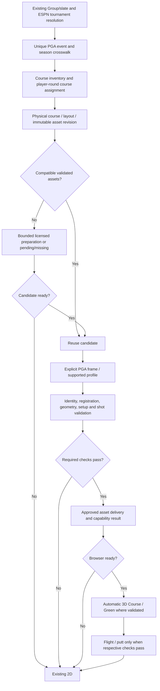

# Phase 4A — Golf 3D ShotCast scalability audit

Research date: **2026-10-05**. Status: **research/architecture only; implementation not authorized**.

## 1. Executive summary

**CONDITIONAL GO** for automatic, validated 3D on the subset of PGA TOUR event/course/hole combinations that has the necessary assets, supported coordinate semantics, usable shots, and distribution rights. **NO-GO** for promising full 3D replay for every tournament or using coarse/generated terrain as trustworthy green topography.

The largest finding is **VERIFIED**: the donor research already discovered and prepared PGA-authored terrain, detailed greens, imagery, worldfiles, and explicit coordinate registration from event metadata at multiple courses. Southwind does not intrinsically require manual modeling. Fresh provider reads in this audit also locate these assets across varied venues and an upcoming tournament. Existing donor artifacts are research evidence, not production-approved assets.

**STRONGLY SUPPORTED:** the accepted transform can generalize to compatible PGA assets without fitting tee/green anchors. Fresh Waialae, Spyglass, and Pebble endpoints register onto existing research geometry using unchanged Take2 math. This establishes offline consistency, not visual acceptance or independent survey accuracy. Coordinate frames and asset versions are not permanent properties of a course ID.

**VERIFIED:** coverage is uneven. Historical coordinates survive at least one 2017 event; radar flight, putt paths, detailed green objects, and registration metadata do not share that retention horizon. A 2026 links-course sample has native endpoints but no flight or putting samples. Masters and STATS-only alternate courses supply missing/sentinel positions. Most Sony/Pebble putting paths are labeled `camera`, outside the accepted simulation-only contract.

**UNKNOWN / prerequisite:** permission to automate acquisition, persist, transform, and distribute PGA assets/data for this application. Public HTTP access is not such permission. PGA's published terms restrict commercial use and automated collection, and require licensing for relevant uses. Resolve this before a production acquisition or delivery implementation. This report is technical evidence, not a legal opinion. [PGA terms, §7 and ShotLink provisions](https://www.pgatour.com/company/terms-of-use).

Recommend the **2026 Sony Open, Waialae (R2026006 / 006), Chris Gotterup 59095, round 1, hole 10** as the earliest new-course Take2 proof. Its nonzero rotation, automatically discovered research package, detailed green, flight data, and freshly verified grounding test the actual generalization question. Full putting support is a separate gate.

## 2. Phase 3 baseline reviewed

### Repository and safety baseline

The requested `~/nba-fantasy-app` is the main worktree, not the requested ShotCast branch. Work was conducted in the existing branch worktree:

| Item | Observed baseline |
|---|---|
| Active repository/worktree | /home/markwohlever/nba-fantasy-app-3d-take2 |
| Branch | shotcast-3d-take2 |
| HEAD | c0977b3e1a4c79dc82465d1f0aa0595d5e1802dd |
| Initial working tree | clean |
| Main worktree | /home/markwohlever/nba-fantasy-app; main; 5227a2535d279ec6d9a189e4271e0db5d1db0fd2; initially clean |
| Donor | /home/markwohlever/nba-fantasy-app-3d; shotcast-3d; 29307237d8b731921aa441a94af53384e9ab95b1; pre-existing dirty tree |
| Authorized output | this single audit document |

**VERIFIED:** all existing Phase 1–3 documents in this directory were reviewed: TAKE2-FOUNDATION, ACTIVATION-INVESTIGATION, COURSE-PLAYER-SEPARATION, PHASE2-WORLD-CORRECTNESS, PHASE2-MARKER-SEMANTICS, PHASE3-DONOR-AUDIT, PHASE3-FLIGHT-FOUNDATION, PHASE3-GREEN-INTEGRATION, PHASE3-GREEN-VISUAL-POLISH, PHASE3-ACCEPTED-BASELINE, and donor-reference/NONZERO-ROTATION.

Frozen invariants from [the accepted baseline](PHASE3-ACCEPTED-BASELINE.md) and inspected source:

- `productionGeometry.ts`: Float32 feet-to-metres conversion (0.3048), Float32 Z rotation, Float32 course-offset subtraction; retain native-derived XY. Ground Z comes from the first containing detailed-green triangle, then terrain. Do not substitute native Z, nearest-triangle snapping, anchor fitting, or visual nudging.
- Authored GLB coordinates are metre XY with Z up and identity transforms under the supported profile. Image worldfiles place textures; they do not re-register shot geometry.
- `holeWorld.ts`: one fixed world from authoritative tee/shot/pin points and geometry; camera/green views never relocate it. Shot markers mean shot starts; tee comes from Shot 1's exact native `from`.
- `developmentAssetResolver.server.ts`: uniquely resolve event/course/hole package; verify player/round course independently, asset hashes, and supported engine profile. Current-player native payload remains separate from course geometry.
- Flight and putting are separate optional capabilities. Accepted flight semantics are the supported Broadcast/Incoming branch, with bounded endpoint-origin correction and presentation timing. Accepted putting requires real `simulation` samples and their times; `camera` is unsupported. The small made-cup terminal correction is presentation, not invented physics.
- Green View consumes real detailed triangles. Slope/flow presentation is derived from that mesh, not a surveyed putting prediction.
- Production is isolated: normal production remains 2D; the development 3D route is unavailable there. Temporary research assets are excluded from production delivery.

### Existing tournament identity and selection

**VERIFIED** through repository tracing:

1. `lib/providers/golf.ts` uses ESPN schedule/scoreboard and leaderboard APIs. Slates retain ESPN identity in `external_event_id`. `app/api/golf/schedule/route.ts` returns event IDs/names/dates, not a durable physical-course identity.
2. `lib/golf/refreshSlate.server.ts` resolves a slate's external event and start year. Group/league scope and frozen fantasy rules remain independent of any shared course registry.
3. `lib/providers/pgaTourShots.ts` maps slate name/year to the PGA schedule, maps player names to PGA players, then reads `ShotDetailsCompressedV3` with radar. Schedule cache is one hour, player directory one day, shots 120 seconds. `pgaTourTeeTimes.ts` has another schedule/slug resolution path; `pgaTourField.ts` also resolves schedule/overview metadata. These paths are an eventual consolidation point, not a mandate for a broad refactor.
4. `components/golf/GolfLivePage.tsx` requests the active Group's home summary. `golfHomeSummary.ts` chooses live, started-open, next-upcoming, then completed slate priority. There is no universal all-history tournament picker on that page. Historical selection exists in Scores and shares downstream scorecard/replay behavior.
5. `lib/shotcast/importShotCastManifest.ts` already reads PGA hole/course information and imports 2D material. `scripts/import-shotcast-course.mjs` writes 2D images/manifests, not a validated general 3D library. It was not executed.
6. `golf_slate_shotcast_manifests` is Group/slate scoped; the Groups migration preserves legacy manifests. It must not become a global geometry table. `upsertGolfCourseHoles.ts` scorecard metadata is not the player-round physical-course join needed for multi-course replay.
7. The authorized `/api/golf/hole-replay` GET also reconciles stored golf scores. It was **not called** during this audit. Provider reads were used directly, avoiding application/database mutations.

ESPN and PGA IDs are different namespaces. Fresh Sony evidence gives ESPN event **401811928**, PGA **R2026006**, ESPN course **2**, PGA course **006**. ESPN's static H10 yardage is 351; Gotterup's PGA round-1 H10 is 339. Do not derive a registration scale from ESPN scorecard yardage.

**INFERRED architecture direction:** add capability resolution to this existing slate/event resolution chain, retaining the authorized Group/slate context. Do not introduce a second manually curated tournament catalogue. PGA season is not always start-date calendar year: the fetched 2023/2017 season schedules include events played in 2022/2016. Cross-provider matching must use season-aware date windows and explicit ambiguity rejection.

## 3. Events and courses actually audited

Fresh metadata/configuration was inspected for the 25 event IDs in Appendix A. Additional older REST checks covered 2017, 2010, and 2003; retained donor evidence covered Detroit. Nine schedule seasons (2017, 2018, 2019, 2020, 2023–2027) were fetched. This is a deliberately varied sample, not a census.

| Event family | Years/course evidence | Audit depth |
|---|---|---|
| FedEx St. Jude / WGC St. Jude / FedEx St. Jude Classic | 2026, 2025, 2024, 2020, 2019, 2018, 2017; Southwind 513 | Fresh round samples; recurring transforms; selected current/older asset probes; accepted geometry |
| Wyndham | 2026, 2025; Sedgefield 752 | Fresh 2026 shots, metadata across years, HEAD assets, donor package |
| Sony Open | 2026; Waialae 006 | Fresh full R1, exact course join, HEAD assets, retained package and unchanged-math proof |
| AT&T Pebble Beach | 2026; Pebble 005 / Spyglass 205 | Same player's R1/R2 shots and independent course assignment, alternate root/offset, both retained packages |
| BMW | 2026 Bellerive 679 / 2025 Caves Valley 882 / 2024 Castle Pines 406 | Fresh identity/config; Bellerive H1 asset HEAD; schedule also shows 2023 Olympia Fields and 2027 Liberty National |
| TOUR Championship | 2026/2025 East Lake 688, 2024 East Lake 933, 2023 East Lake 688 | Fresh shots in 2026/2024/2023, configuration comparison; 2023/2024 green meshes decoded in memory |
| Bank of Utah Championship | 2026 Black Desert 930; Oct 1–4 just completed | Fresh R1, tee-time join, assets HEAD, drop anomaly |
| Genesis Scottish Open | 2026 Renaissance 945 | Fresh R1 endpoints; no sampled radar/putt paths; assets HEAD |
| Farmers | 2026 Torrey South 004 / North 104 | Fresh R1 and tee-time join; North is STATS and South TOURCAST |
| American Express | 2026 Stadium 704 / Nicklaus 233 / La Quinta 202 | Fresh R1 and all-round course join; only Stadium TOURCAST |
| Masters | 2026 Augusta 014 | Fresh no-shot response with zero anchors; BASIC metadata |
| Baycurrent | Upcoming 2026 Yokohama 936, Oct 8–11 | Published overview/course/config; assets HEAD/courseData; empty tee times/shots and sentinel hole pin |
| RSM | Upcoming 2026 Seaside 776 / Plantation 889 | Future course inventory; sentinel config, assets 403, sentinel hole pin |
| St. Jude | Upcoming 2027 Southwind 513 | Venue/course identity months ahead; config sentinel, assets 403, no round assignments/pin |
| Rocket Classic | 2026 Detroit 947 | Donor discovery/package evidence and fresh schedule only; no new round fetch |
| Older St. Jude checks | 2010 R2010025 / 2003 R2003025 | REST format-rejection responses only; ShotCast retention unresolved |

**VERIFIED limits:** full-round payloads were inspected, with selected H1/H10/H18 endpoint details and explicit anomaly holes. Asset HEAD is object accessibility only. Only four small historical green GLBs were newly downloaded for in-memory inspection; no course library was downloaded, no packages/assets were generated, and no donor commands that prepare/write data were run.

## 4. Provider availability matrix

Appendix B lists actual player/round counts and request hashes. Counts are **raw records**, not a promise of playable or validated paths.

| Field/group | Evidence and consistency | Classification |
|---|---|---|
| PGA event ID, season, tournament name, dates | Schedule/overview supply these broadly; leaderboard shape differs and does not always repeat name/year | VERIFIED sample; source-specific |
| Course inventory and course ID | Leaderboard/overview course lists; host flag and TOURCAST/STATS/BASIC scoring levels | VERIFIED; course/event-specific |
| Geographic metadata | City/state/country in schedule/overview, address in ESPN; inspected records provide no usable lat/lon/projection for registration | VERIFIED absence in inspected fields; universal absence UNKNOWN |
| Actual course being played | Tee-time round/group/player `courseId`; not supplied by the sampled ShotDetails holes themselves | VERIFIED; player-round-specific |
| Hole number/par/yardage | Native holes and HoleDetails; actual round yardage differs from ESPN static card | VERIFIED; hole/round-specific |
| Tee, pin, fairway centre | Native shot payload has overview/green paired frames. Values can be zero or -1 sentinels; fairway centre can be missing in older data | VERIFIED; optional until semantically validated |
| Exact tee/start | Shot 1 `from` has greater precision than rounded hole tee metadata | VERIFIED; preferred accepted anchor |
| Hole identifiers/references | HoleDetails ID combines event-course-hole; pickle/enhanced-pickle references are image resources, not automatically 3D assets | VERIFIED |
| Coordinate metadata | Native tourcast XYZ and explicit TOURCAST offset config; no inspected EPSG/WGS84/datum declaration | VERIFIED fields; geographic interpretation UNKNOWN |
| `fromCoords`/`toCoords`, LR/BT frames | Full native positions broadly retained in sampled ALL rounds. LR/BT tourcast triples agree where compared; enhanced image XY can differ | VERIFIED sample; not all scoring levels |
| `tourcastX/Y/Z` | Finite coordinates can still be zero or `[-1,-1,-1]`; no finite-only admission | VERIFIED |
| Radar/polynomial flight | Southwind/Sedgefield/Sony/Pebble/Black Desert/East Lake recent samples contain rows; Renaissance and older Southwind samples have none | VERIFIED optional, coverage-specific |
| Flight branch/type | 2023 East Lake radar rows have null type, unlike accepted Broadcast/Incoming rows | VERIFIED; unsupported until separately proven |
| Putting ballPath/time | 2026 samples include `simulation` and `camera`; 2025/2024 and older sampled rounds have none | VERIFIED sample; no blanket historical cutoff |
| Lie and stroke type | Tee/green/rough/etc., penalties, drops, duplicate stroke numbers | VERIFIED; semantic normalization required |
| Timing | Putt samples carry source time; flight polynomial interval and 3-second UI playback have different meanings | VERIFIED accepted contract |
| Availability flags | ALL/NONE/PLAY_BY_PLAY, scoring level, enabled/config, SHOT_DETAILS, tourcastURLWeb | VERIFIED indicators; unreliable as sufficient admission proof |

Concrete contrasts:

- Southwind 2026 R1: 68 records, 31 flight rows, 22 simulation paths.
- Sony 2026 R1: 64 records, 29 flight rows, 13 paths: **12 camera, 1 simulation**.
- Pebble/Spyglass 2026 R1: 69 records, 28 flight rows, 22 paths: 16 camera, 6 simulation. Pebble R2: 14 camera, 1 simulation.
- Renaissance 2026 R1: 65 records with native endpoints, **zero flight rows, zero paths**.
- East Lake 2023: 30 radar rows with null branch type. Do not silently reinterpret them.
- Masters 2026: 18 hole metadata rows, **zero shots**, NONE; tee/pin/fairway positions zero.
- Farmers Rose R1 on North and AmEx Scheffler R1 on La Quinta: PLAY_BY_PLAY, zero radar/paths, placeholder positions. Host-course 3D assets cannot remedy alternate-course missing coordinates.
- Southwind R2 H12 has PENALTY and DROP at duplicate stroke 2; DROP positions are `[-1,-1,-1]`. Sony H9, Black Desert H14, and Pebble R2 H9 also have drops/duplicate numbers. Exact continuity is not universal and legitimate repositioning must not be animated as a continuous shot.
- Upcoming HoleDetails says SHOT_DETAILS and tourcastURLWeb "true" even when there are zero rounds and a -1 pin. Historical 2020/2017 HoleDetails returns "No hole stats data" even though ShotDetails retains native shots. Each API has its own coverage.

**UNKNOWN:** a live-versus-final payload coverage guarantee. Most fresh shot evidence here is finalized; the audit does not establish how every field evolves during live play. Missing optional samples must remain missing capabilities.

## 5. PGA coordinate-system findings

### Explicit frame evidence

All values below are provider configuration, not fitted parameters. Offset units are used as metre world offsets by the validated engine profile; rotation is the profile's Z-rotation angle in degrees (the accepted code forms the quaternion with rotate × π / 360).

| Event/course | Offset x / y / z; rotate |
|---|---|
| Southwind 2026 and 2025 / 513 | 3200.056917 / 3099.998293 / 0; 0 |
| Southwind 2024 and 2020 / 513 | 3302.020150 / 3032.020801 / 0; -1.634877 |
| Sedgefield 2026 and 2025 / 752 | 3272.777305 / 2829.826863 / 0; 0.919828 |
| Waialae 2026 / 006 | 3225.238265 / 3122.877394 / 0; 0.424586 |
| Pebble host 2026 / 005 | 2649.998874 / 3300.061931 / 0; 0 |
| Spyglass alternate 2026 / 205 | 3249.926282 / 3400.209492 / 0; 0 |
| East Lake 2026/2025 / 688 and 2024 / 933 | 2949.869284 / 3350.058929 / 0; 0 |
| East Lake 2023 / 688 | 3016.483063 / 2862.805400 / 0; 1.512202 |
| Yokohama upcoming 2026 / 936 | 2949.790188 / 2800.030397 / 0; 0 |
| 2019/2018 Southwind, upcoming RSM/2027 Southwind | placeholder -1 / -1 / 0; -1 — reject |

**VERIFIED:** one event config applies across its sampled holes; alternate-course override selects another frame. Donor source implements a course override as a complete x/y/z/rotate replacement, not an additive correction. Coordinate magnitude/continuity and simultaneous multiple-hole placement fit a course-sized frame.

**STRONGLY SUPPORTED:** native coordinates are course-centric survey/model coordinates, with an **event/course/version binding**. They are not hole-local, screen-local, or camera-local. Neither raw triples nor .tfw files inspected here establish a geographic CRS. Do not label them longitude/latitude, UTM, or a known vertical datum.

**VERIFIED:** frames can be reused annually but are not stable across all years. Southwind 2024/2025 switches frame despite retaining course 513. East Lake changes frame/mesh and temporarily course ID in 2024; course 688 returns later. A stable ID is not a stable geometry revision.

**STRONGLY SUPPORTED:** daily tee/pin changes normally select new points within an existing event/course frame, rather than require a new global transform. Southwind R1/R2 data has changed setup while the same configuration remains. **UNKNOWN:** exceptions after provider remapping, renovation, emergency alternate tees, or mid-event asset replacement. Revalidate setup changes and config/hash drift; never assume universality.

### Anchor comparison with unchanged accepted math

Fresh native endpoints were evaluated offline against retained donor bytes using unchanged Take2 `productionGeometry.ts`.

| Case | Result |
|---|---|
| Sony Gotterup R1 H10 | All three shots' starts/ends have containing ground; pin falls on detailed green; consecutive XY endpoints agree exactly |
| Spyglass Morikawa R1 H1 | All four shots ground; pin on detailed green; correct alternate-course offset/root |
| Pebble Morikawa R2 H1 | All four shots ground; pin on detailed green; correct host-course frame |

Sony tee world: **(-157.569091796875, -106.43359375, -19.777041853871197)**. Final pin: **(119.671142578125, 29.0185546875, -19.235471572331665)**. Sony green Z is negative, valid in this authored frame.

Spyglass first endpoint: **(-303.873779296875, -24.959716796875, 29.246308589210877)** from native **(9665.526, 11073.654, 126.086)**. This also matches the donor's independent original PGA coarse-ground capture (XY exact; Z difference about 4.2e-13 m). Detailed Green View/browser parity has not been independently accepted there.

These are **VERIFIED computations** and **STRONGLY SUPPORTED generalization evidence**. Mesh containment and a same-provider pin are useful consistency checks but do not independently establish physical survey accuracy. Waialae still needs an independent PGA runtime capture and manual Take2 visual acceptance.

## 6. Course-geometry source findings

### PGA direct sources and existing research

**VERIFIED:** donor `DISCOVERY-CHAIN.md`, `DISCOVERY-EXPERIMENT.md`, discovery source, multi-course reports, and retained package provenance identify a deterministic event→course→asset chain:

```text
TOURCAST page/config + engine profile
PGA leaderboard course inventory
PGA tee times: player + round → actual course
host:      https://tourcast.pgatour.com/models/{event}/3D_Assets/
alternate: https://tourcast.pgatour.com/models/{event}/{courseId}/3D_Assets/
  terrain/cutGlb/terrainNN.glb
  terrain/greens/GreenNN.glb
  terrain/terrainNN.jpg + terrainNN.tfw
  terrain/cutouts/{hole}.png
  terrain/course.jpg + course.tfw
  data/courseData.json
```

Donor event-only discovery includes unfamiliar Waialae, not merely known Southwind. Seven retained packages across six event/course/hole contexts had all eight spatial artifact hashes rechecked successfully. Two Sony captures have identical green hashes; scanning for a unique package is not a durable registry revision policy.

Fresh HEAD probes return 200 for selected Southwind, Sedgefield, Waialae, Spyglass, Black Desert, Renaissance, Bellerive, and upcoming Yokohama terrain/green URLs. Bellerive H1 terrain is **10,045,060 bytes**, versus Sony H10 **781,324**: mobile resource costs vary materially. Upcoming RSM/2027 Southwind and 2019 Southwind objects return 403; that means unavailable to this audit, not a definitive proof that no object exists. No access bypass was attempted.

PGA reports TOURCAST's 2020 debut and later drone/handheld mapping and photogrammetry. This explains a plausible provider-authored source; it does not publish the sampled meshes' surveyed accuracy or confer reuse rights. [PGA technical account](https://www.pgatour.com/korn-ferry-tour/article/news/latest/2024/04/19/korn-ferry-tour-tourcast-product-will-provide-real-time-shotlink-select-data).

**UNKNOWN:** all-event asset completeness, official supported export API/SLA, renderer compatibility across future engines, guaranteed history retention, and distribution license. An HTTP 200 or a research package is not production admission.

### Alternatives and legal/technical delivery

The table separates **VERIFIED source capabilities** from **INFERRED suitability**. No listed alternative was used to generate a course in this audit, and specific-course coverage was not established unless stated above.

| Source class and exact primary source | Provides / resolution / coverage | History, future, automation | Green View / storage implications |
|---|---|---|---|
| PGA direct, URLs above | Authored terrain/green triangles, registered aerials/masks, setup/camera data; sampled greens ~4k–7k vertices | Reusable candidate assets, event-specific revisions; bounded automated preparation technically demonstrated in donor | Best technical match. Accuracy unknown; acquisition and redistribution rights unresolved |
| ESPN, scoreboard and leaderboard endpoints in Appendix F | Event/course identity, address, par/yardage/scorecards | Existing app integration; historical availability depends on event; no inspected 3D geometry | Not a mesh/topography source; provider usage rights separate |
| [OSM golf schema](https://wiki.openstreetmap.org/wiki/Key:golf), [hole paths](https://wiki.openstreetmap.org/wiki/Tag:golf=hole), [license](https://www.openstreetmap.org/copyright) | Volunteer tee/green/fairway/bunker polygons and hole lines; water via normal map features; worldwide but uneven, no uniform precision | API/bulk automation possible; edit history records map edits, not proof of historical course layout | No green elevation/round cup. ODbL attribution and applicable database share-alike; not a license for underlying aerial imagery |
| [USGS 3DEP quality levels](https://www.usgs.gov/3d-elevation-program/topographic-data-quality-levels-qls), [products](https://www.usgs.gov/3d-elevation-program/about-3dep-products-services), [downloads](https://www.usgs.gov/the-national-map-data-delivery/gis-data-download) | US elevation/point clouds; QL2 specification: 1 m DEM, ≥2 points/m², 10 cm vertical RMSEz | Project dates/datum and geographic coverage need lookup; archived surveys can support selected history; future venue terrain can be preprocessed | Useful base terrain; no uniform fine green survey. Government data generally public domain; inspect individual product metadata and third-party components |
| [USGS NAIP archive](https://www.usgs.gov/centers/eros/science/usgs-eros-archive-aerial-photography-national-agriculture-imagery-program-naip), [image service](https://imagery.nationalmap.gov/arcgis/rest/services/USGSNAIPImagery/ImageServer) | US aerial orthophotos, typically 0.6–1 m depending vintage; service metadata determines actual resolution | Dated archive/API; not a guarantee at Hawaii/international courses | Surface texture/feature extraction, no elevation; public-domain source assets subject to actual dataset metadata |
| [NOAA coastal lidar](https://coast.noaa.gov/digitalcoast/data/coastallidar.html), [access viewer](https://www.coast.noaa.gov/digitalcoast/tools/dav.html), [archive](https://coast.noaa.gov/htdata/lidar1_z/index.html) | Coastal point clouds/DEMs; resolution/dates vary, potentially useful for island/coastal venues | Searchable/downloadable survey records; not guaranteed coverage of Waialae or every green | Assess density, grass/ground classification, datum and dataset rights before storing/deriving meshes |
| [OpenTopography developer APIs](https://opentopography.org/developers), [citations](https://www.opentopography.org/citations), [subscriptions](https://www.opentopography.org/about/subscriptions) | Catalog of lidar/DEMs plus global terrain; resolution and coverage by source | Programmatic catalog/data access; keys/subscription limits and survey dates vary | Source-specific licensing/DOI attribution. Portal access is not universal redistribution permission; fine green suitability unverified |
| [England 2022 1 m DTM](https://www.data.gov.uk/dataset/01b3ee39-da3f-47b6-83da-dc98e73a461f/lidar-composite-dtm-2022-1m) | National England terrain product; does not establish Scotland coverage | Dated national product; regional catalogs can broaden base terrain | Dataset license must be checked; not an independently verified green survey |
| [Japan GSI aerials](https://www.gsi.go.jp/gazochosa/gazochosa41022.html), [elevation service](https://maps.gsi.go.jp/development/elevation_s.html) | Regional imagery and elevation products (1/5/10 m catalog classes) | Programmatic access and vintages where published; specific Yokohama resolution/rights not verified | Useful base/source candidate; neither fine green readiness nor shipping rights established |
| [Mapbox Terrain-RGB](https://docs.mapbox.com/data/tilesets/reference/mapbox-terrain-rgb-v1/) | Global terrain; information capped at zoom-15 equivalent, mixed vertical datums | APIs; RGB updates stopped in 2021, Terrain-DEM successor | 0.1 m encoding increments are not accuracy. Coarse for green contours; attribution and contract/storage rules apply |
| [Google Tile policies](https://developers.google.com/maps/documentation/tile/policies?hl=en) | Photorealistic viewing tiles/imagery, location-dependent fidelity | Commercial API with attribution/cache restrictions | Not assumed to permit mining/converting/persisting an independent GLB library; green accuracy unverified |
| [Nearmap APIs](https://developer.nearmap.com/docs/about-nearmap-apis), [coverage](https://developer.nearmap.com/reference/coverage), [DSM/ortho API](https://developer.nearmap.com/reference/dsm-and-true-ortho-api-1), [terms](https://www.nearmap.com/legal/product-specific-terms) | Commercial high-resolution imagery and DSM products; survey metadata/coverage/product resolution vary | API acquisition and dated surveys within contracted coverage | Export, derived-product and serving rights require contract review; grass-height/green precision not established |
| [StrackaLine catalog](https://strackaline.com/courses/store?aff=ANWFPGA), [PuttView Books](https://puttviewbooks.com/) | Commercial green guides/contours; vendor precision claims | Potential licensed green data relationship, not a verified public raw mesh API | Raw survey/API/export/redistribution terms UNKNOWN. Buying a book is not permission to ship its data |
| Licensed course-owner CAD, RTK/drone/lidar surveys | Potential accurate physical footprint/topography | Commissioned acquisition; expensive/manual field work and dated snapshots | Could satisfy fine green requirement with controlled provenance; global unattended coverage UNKNOWN |
| Our inferred/generated data | Meshes from licensed DEMs, traced imagery/OSM, deterministic simplification | Base terrain automation plausible | Neither invented greens nor AI illustrations establish real topography; reject for accepted Green View |

**INFERRED:** public geospatial products could automate attractive base-course geometry for selected venues. They do not currently close the combined fine-green + PGA/geographic-registration + historical-version problem. Do not build that broad pipeline ahead of the direct-provider proof.

## 7. Green-topography findings

**VERIFIED** in retained meshes and four bounded fresh GLB inspections:

| Green | Vertices / triangles | Z span | Interpretation |
|---|---:|---:|---|
| Southwind 2026 H1 | 4,166 / 8,158 | 0.694 m | Accepted detailed mesh |
| Sedgefield 2026 H1 | 4,263 / 8,266 | See retained package | Real non-flat authored green |
| Detroit 2026 H8 | 4,175 / 8,092 | 1.090 m | Research only |
| Waialae 2026 H10 | 4,183 / 8,108 | 0.847 m | Negative world Z valid |
| Spyglass 2026 H1 | 4,176 / 8,094 | 1.155 m | Detailed mesh exists; independent detailed runtime acceptance pending |
| Pebble 2026 H1 | 4,160 / 8,136 | 1.114 m | Research only |
| Southwind 2024 H1 | 4,623 / 7,201 | 0.655 m | Different world/frame/revision |
| East Lake 2023 H1 | 6,055 / 9,846 | 1.237 m | Pre-restoration/version evidence |
| East Lake 2024 H1 | 7,007 / 11,574 | 1.003 m | Changed bounds/geometry/version |

Parsed GLBs have identity transforms, normals, and no required compression extensions in these selected files. The bounding-box-area/vertex-count spacing estimate is roughly 0.34–0.49 m for retained packages; it is **not** measured edge spacing, centimetre survey accuracy, or green-speed accuracy.

Southwind 2025 and 2026 H1 have the same XY bounds/topology count but different hashes and about 0.000092 m Z shift. Even apparently equivalent assets need explicit revisions/hash identity. East Lake 2023/2024 mesh bounds and Z change materially. PGA's official restoration account supports an actual course-version boundary, rather than a name-based alias assumption. [East Lake restoration](https://www.pgatour.com/article/news/latest/2024/08/26/east-lake-looks-back-to-move-forward-restoration-tour-championship-fedexcup-playoffs).

**UNKNOWN:** provider mesh surveyed accuracy, sampling process per green, and whether the green includes all fringe/temporary cup areas. **INFERRED:** detailed PGA triangles are sufficient to reproduce the accepted visual topography architecture for validated holes; fine physical putt prediction is a different claim.

General DEMs can miss the subtle relief demonstrated here. Public lidar must be evaluated using local density, survey date, vertical error, datum, filtering and holdouts. A 1 m grid or a decimal height encoding alone does not establish a trustworthy Green View.

## 8. Registration feasibility

### Preferred path: explicit provider registration

**STRONGLY SUPPORTED:** automate discovery and validation of a published transform for a pinned compatible asset/engine profile, rather than solve a new anchor fit for every event.

The engine-3.3.1 research profile has engine SHA-256 `2a64bbe1e11db7343aab33ca91a357e87139ef0becbbc869d89c73c4a99f3018` and captured application SHA-256 `b4e64727f646e6baa8d68f6c3cae308c25eb86c039d9869b6bf998ca12a225cd`. These fingerprints document a verified profile, not permanent PGA API contracts. An application bundle hash can change for unrelated reasons; initially quarantine unknown profiles, then approve a reviewed semantic profile without blindly relaxing math.

```text
actual event/course/player-round binding
   → supported profile + explicit course offset
   → immutable compatible assets
   → unchanged Float32 transform / ground query
   → independent profile oracle + event-specific holdouts
   → ACCEPT or REJECT
```

Independence has two layers:

1. **Engine parity:** independent PGA runtime captures not generated by our implementation, including nonzero rotation and alternate-course override. Keep accepted numeric gates; donor Spyglass coarse comparison uses 1e-8 m, existing browser/profile checks use their separately documented tolerance (e.g. 5e-5 m). These are computational parity limits, not survey accuracy.
2. **Event/asset correctness:** independently obtained course assignment; actual pin inside the correct detailed green; tee/start and endpoint ground coverage; image/worldfile alignment; multiple holes/rounds and holdouts not used to choose the transform; version and source integrity. A single good-looking point is insufficient.

Pin and tee in `courseData.json` are useful independent request evidence but still same-provider material. Observed `pinsTees` has one row even for four-round events, sometimes 19 entries. It is **not verified** as authoritative per-round pin setup. The current importer's row-as-round behavior is a future investigation item, not something changed here.

### Alternative geospatial solver

**INFERRED mathematical feasibility**, **UNKNOWN data feasibility**: a 2D similarity transform requires scale, rotation and translation, with separately determined axis handedness. Two distinct exact correspondences can solve four parameters, but provide no independent residual test. Use three or more well-separated, preferably non-collinear anchors and additional withheld checks; reject ambiguous reflections/axis swaps and implausible scale. A full spatial transform needs known vertical datum/offset and independently measured elevation.

Possible correspondences are exact surveyed tee/pin points or identifiable surveyed features with exact native matches. OSM tee polygons, a green centre, a hole line, and nominal yardage are not exact correspondences to the cup/first-shot start. Shot continuity verifies internal consistency, not geographic alignment. PGA native Z cannot simply be translated onto an unrelated DEM when the accepted profile grounds from authored surfaces.

**NO-GO** for unattended best-fit registration to public geometry with today's unverified correspondences. No universal geodetic conversion or independently quantified physical residual budget was found. Keep this as a separate future proof, not a fallback that silently accepts plausible imagery.

## 9. Proposed 3D availability / validation gate

**INFERRED proposed contract:** a result is specific to **event + actual course + course revision + hole + round/setup + provider profile + payload revision + device**. It is not a single permanent `event.has3D` boolean.

Return Course, Green, flight and putt capabilities independently, with stable reason codes, validated artifact references and provenance. No normal user "enable 3D" step. An uncertain required input yields 2D. Missing optional replay data disables that replay, not a fabricated arc/path.

| Check | Class | Admission/failure rule |
|---|---|---|
| Authorized Group/slate/event; unique ESPN↔PGA mapping | REQUIRED | Ambiguous name/date/season match → 2D |
| Actual course for selected player/round; physical/layout identity and playing-hole map | REQUIRED | Missing/ambiguous assignment or host assumption → 2D |
| Source acquisition/serving rights established | REQUIRED for production delivery | Unresolved rights → no production 3D assets |
| Compatible immutable asset revision and profile | REQUIRED | Missing, unknown engine, config sentinel, wrong historical frame → 2D |
| Asset hashes, source manifest, safe sizes/types/decoding | REQUIRED | Hash mismatch, invalid indices/non-finite triangles/unsupported transforms or resource overrun → quarantine and 2D |
| Valid native positions and semantic schema | REQUIRED | Reject sentinel/zero-placeholder patterns, wrong identity/round/hole, impossible endpoints, unsupported payload shape |
| Registration independently validated | REQUIRED | Reviewed profile oracle and event holdouts must pass; visual plausibility alone fails |
| Exact Shot 1 start/tee ground, pin/surface plausibility, selected starts/ends | REQUIRED | No containing expected ground or inconsistent setup → hole 2D; no nearest-triangle snap |
| Continuity/stroke semantics | REQUIRED | Preserve penalties/drops; unexplained gaps or ambiguous dedup affecting replay → relevant hole/replay 2D |
| Correct imagery/worldfile and base terrain | REQUIRED for accepted Course presentation | Misregistration or missing required visual artifact → 2D |
| Detailed green mesh, valid topology/normals/height, pin on correct green | REQUIRED for Green | Missing/invalid detail → Green 2D; independently valid Course may remain available |
| Valid native simulation putting samples/times | OPTIONAL; REQUIRED for 3D putt replay | `camera`, empty/invalid samples, unsupported endpoint → 2D replay |
| Supported radar flight branch/polynomial interval/endpoints | OPTIONAL; REQUIRED for 3D flight replay | Unsupported/null/missing flight → 2D replay |
| Finite slope/flow derivation and accepted green presentation | REQUIRED for respective Green overlays | Invalid derivation → disable overlay/Green according to capability contract |
| Browser/WebGL/resource/first-frame readiness | REQUIRED at runtime | Context/decode/timeout/loss failure → immediate existing 2D escape path |
| Survey accuracy and alternative-source geodetic anchors | REQUIRED if claiming/using independently sourced physical green geometry | No validated error budget → do not admit alternative as equivalent |
| Static yardage, centreline, fairway centre, availability flags | DIAGNOSTIC | Support investigation; cannot replace actual anchors |
| Source age, response timing, endpoint distance, point containment residuals | DIAGNOSTIC | Log for drift; stale live setup becomes required-freshness failure |
| Optional richer metadata/video | OPTIONAL | Omission never fabricates data or blocks independently valid geometry |

**3D AVAILABLE:** all required checks for the requested capability pass and the browser is ready. **2D FALLBACK:** any critical check is missing, ambiguous, stale, incompatible or failed. Scope failure to the smallest safe capability/hole, while preserving truthful presentation.

Do not invent a "95% confidence" score or physical-metre tolerances in this audit. Required numeric budgets must come from the frozen engine parity tests, known coordinate rounding, and future independently measured validation error. Parity tolerances and physical accuracy budgets must remain separate.

A course corridor should allow plausible rough/adjacent-fairway/water outcomes; requiring every endpoint to be inside the ideal fairway would reject real golf. Conversely, merely being somewhere on a large terrain tile is too weak. Cross-check hole routing and actual lies, with explicit unresolved-outlier rejection.

## 10. Course identity / versioning model

**INFERRED minimal model:**

| Scope | Owns |
|---|---|
| COURSE (physical venue/course) | Stable internal identity, location/name history, provider aliases with event/date validity; no assumption one provider ID = one physical version |
| COURSE VERSION / layout | Renovation/layout validity interval, physical hole identities/routing, source survey date, geometry provenance |
| ASSET REVISION | Immutable terrain/green/imagery hashes, parser/profile compatibility, validation generation/date; separate from actual renovation |
| EVENT | PGA ID, ESPN crosswalk, season and dates, format, course inventory/host flags, source roots/config/profile, compatible version bindings |
| HOLE | Physical hole geometry/green and authored index; event playing-number map can differ |
| ROUND / SETUP | Observed tee/pin/par/yardage revision, source time, player/group course assignment, weather/setup deviations |
| PLAYER SHOTS | Player+round native payload revision, stroke semantics, optional radar/putt capability; not shared geometry |
| REGISTRATION BINDING | Event/course/provider-frame/asset-revision transform, validation evidence and compatibility interval |

Recurring Southwind may reuse byte-identical geometry but cannot borrow a 2025 transform for 2024. East Lake 688/933 needs explicit aliases and renovation/version handling; returning to ID 688 does not resurrect the pre-restoration course. BMW's annual venue change is event-course binding, not a version of one BMW course.

Group membership, slate ownership, historical relationships, notification settings and frozen league-rule snapshots are not part of shared geometry identity and must remain intact.

## 11. Asset lifecycle / cache model

**INFERRED architecture:** one durable shared geometry manifest plus content-addressed object storage; separate authorized event binding and short-lived player/setup payloads. No permanent dependency on donor directories or Vercel temporary files.

Lifecycle: **discovered → staged → validated → ready**, with **rejected/quarantined** for failed or changed candidates. Publish a manifest atomically only after all required referenced bytes are available and validated. Keep historical revisions immutable. Retirement means stop selecting an asset; do not delete historical identities or overwrite old manifests.

Deduplicate by content hash and explicitly verified compatibility, not tournament/course name. Reuse a course revision after current event frame/setup validation; changing pin/tee normally updates setup validation, not the mesh. Changed mesh/config/profile enters staging. Preserve source URLs, retrieval date, response/hash/profile and rights basis.

Use a small bounded server/worker preparation process, not unbounded browser downloads or on-demand heavy work inside a replay request. Allowlist provider roots and enforce object/triangle/texture/time budgets. Expose only approved manifest/object URLs; never serve `tmp`, native research captures, or donor packages wholesale.

Cache policy must distinguish no candidate, provider-denied 403, transient transport failure, incomplete future setup, invalid profile, and genuine validated readiness. Negative cache entries expire and retry within bounds; a 403 is not bypassed or treated as an immortal "no course." Current shot/setup freshness can expire independently of unchanged assets. The existing 120-second shot cache is not a guarantee of per-round pin freshness.

## 12. Historical feasibility

| Tier | Meaning | Evidence and limits |
|---|---|---|
| A | Validated course/green plus supported 3D replay for the selected shots | Some 2026 samples have terrain, detailed greens, flight and simulation paths. Coverage must be evaluated per shot; no all-event guarantee |
| B | Validated 3D Course/Green with partial replay; missing flight/putt uses 2D | 2025/2024 Southwind and 2023/2024 East Lake retain useful positions/assets, but paths/flight types vary |
| C | Existing 2D only | Missing frame/assets/course assignment, BASIC/STATS placeholders, unsupported profile or unverifiable historical version |
| Unclassified | Insufficient historical API evidence | 2010/2003 REST rejects schedule format; no conclusion about every older ShotCast endpoint |

**VERIFIED:** Daniel Berger R2017025 R1 has 18 holes and 70 native records, no radar/paths, 52/52 compared continuity pairs. 2018/2019 also retain native records. Their current config is placeholder; 2019 sampled terrain/green access is denied. Coordinates alone do not qualify them for automatic 3D.

2020 Southwind retains 66 records, explicit frame and terrain access; its sampled detailed green URL is 403 and HoleDetails is unavailable. A bounded Course-only proof could be possible, but full accepted Green/replay is not demonstrated.

**STRONGLY SUPPORTED:** selective historical backfill can reuse the architecture. **UNKNOWN:** whole-tour earliest year, complete tournament coverage, survival of the correct historical geometry, and retrospective independence where original runtime captures are unavailable. Current venue geometry must not silently stand in for an old renovation. Keep the original 2D behavior when that historical version cannot be established.

## 13. Future-event preparation feasibility

**VERIFIED** at the observation time:

- Baycurrent R2026527, scheduled Oct 8–11: published course 936, usable offset, courseData and selected terrain/green endpoints three days before play. Object Last-Modified is Oct 5. Tee-time rounds are empty; sampled shots NONE; HoleDetails rounds zero and pin -1. Base candidate preparation is possible; 3D replay is **not ready**.
- RSM R2026493, scheduled Nov 19–22: overview identifies Seaside 776 TOURCAST and Plantation 889 STATS. Hole metadata/availability flags exist but pins are -1; config is sentinel and selected assets return 403.
- St. Jude R2027027: 2027 schedule and overview already identify Southwind 513 about ten months before play. Offset is sentinel, asset requests return 403, tee times empty, pin -1. Existing geometry can be a reuse candidate only.

**INFERRED workflow:** upcoming schedule event → unique existing event crosswalk → full venue/course inventory → registry candidate → licensed preparation/reuse → base validation → wait for actual course assignments/config/round setup/shots → final capability validation → automatic exposure.

Before play, geometry, identity, hashes/profile and base surface validity can be prepared. Actual tee/pin, player-course assignment, selected native shots and replay branches must wait for authoritative data. Revalidate per setup revision/round; adjust the global registration only if independently published/profile-validated frame data changes.

**UNKNOWN:** universal minimum lead time, provider guarantee, or whether all course assets remain stable until first play. Upcoming readiness must be a state machine, not a scheduled "enable 3D" toggle.

## 14. Multi-course and edge cases

**VERIFIED multi-course counterexamples:**

| Event/player | Actual course by round | Consequence |
|---|---|---|
| Pebble / Morikawa 50525 | R1 Spyglass 205; R2–R4 Pebble 005 | Alternate asset root and complete offset override on R1 |
| Farmers / Rose 22405 | R1 North 104; R2–R4 South 004 | R1 STATS-only cannot inherit South's TOURCAST eligibility |
| AmEx / Scheffler 46046 | R1 La Quinta 202; R2 Nicklaus 233; R3–R4 Stadium 704 | Only host Stadium is marked TOURCAST; round/player join is mandatory |
| RSM upcoming | Seaside 776 and Plantation 889 inventory | Assignments pending; event-level host metadata is insufficient |

Sony R1 transport begins at hole 10: split tees must use hole/display identity rather than array position or start-hole=1 assumptions. Southwind courseData contains 19 entries: special/playoff holes must be resolved explicitly, not assume exactly eighteen assets or blindly render a nineteenth regulation hole.

Renamed tournaments and the same venue under R025/R476/R027 require aliases, not name equality. Different IDs for East Lake and materially changed meshes demand versioning. BMW demonstrates changed physical venues. Different events at one course need distinct event-frame/setup bindings.

**INFERRED handling for unobserved cases:** alternate tees/weather pin relocation trigger setup validation; shortened events use actual available rounds without changing Golf's normal four-round/72-hole rules; resumed rounds preserve provider round identity; shotgun/split starts preserve explicit physical-hole maps; match/team/playoff formats outside the supported profile fail closed. Missing holes and partial course coverage are hole/capability failures, not a reason to guess a neighbouring asset.

**UNKNOWN:** actual shotgun-specific ShotCast payload semantics, mid-round course switching, all weather emergency coordinate changes, and every playoff hole mapping. No claims of verified support for those cases.

## 15. Proposed Phase 4 architecture

**INFERRED smallest robust architecture:** extend the existing event resolver with a shared validated-course lookup and a capability result. Prefer published PGA geometry/frame data. Keep generalized geospatial mesh generation out of the initial implementation.



The final arrow to 2D denotes unavailable optional replay and the retained Play Hole escape path, not mandatory navigation out of all 3D.

Responsibilities:

1. **Event resolution:** reuse ESPN/slate identity, resolve PGA uniquely; season/date ambiguity fails.
2. **Course identity:** resolve actual player-round course, provider aliases, physical/layout/hole map.
3. **Preparation:** acquire only licensed bounded candidates, parse supported assets, preserve provenance.
4. **Registry:** immutable content/version manifests, validated event compatibility, readiness state.
5. **Registration:** explicit supported provider transform with independent engine parity; no hidden fitting.
6. **Validation:** objective required checks and optional capability decisions, reason codes and drift rejection.
7. **Delivery:** authorized immutable manifest/storage/CDN, no research-directory exposure.
8. **Capability resolution:** server evidence plus browser readiness; no user preparation workflow.
9. **Fallback:** existing 2D on uncertainty/error, respecting Group/route/player/round context.

A separate independently sourced geometry/registration adapter can be investigated later if provider licensing/coverage requires it; it cannot be treated as ready architecture from this evidence.

## 16. Proposed Phase 4 implementation subphases

All paths below are **proposals**, not added files or authorized implementation. Review this audit first. Each gate should end with evidence; do not automatically begin the next manual gate.

| Phase | Objective and exact question | Expected files/systems | Acceptance criteria | Rollback/fallback | Manual acceptance |
|---|---|---|---|---|---|
| **4B — identity/registry foundation and rights decision** | Can existing ESPN/slate resolution produce an unambiguous PGA event, actual player-round course and immutable course revision? Is intended asset acquisition/serving licensed? | Existing golf/PGA provider resolvers; proposed `lib/shotcast/courseIdentity.ts`, `courseRegistry.server.ts`, minimal registry schema/migration; no renderer edits | Sony, recurring Southwind, BMW venue changes, East Lake aliases and Pebble joins are correct; ambiguity rejects; Group authorization/frozen rules preserved; production rights basis documented | Registry unused by runtime until approved; all production 2D | Yes: identity/schema and rights gate before production-source pipeline |
| **4C — bounded second-course preparation** | Can event-only discovery prepare Waialae using the supported contract without manual modeling? | Proposed server preparation adapter/script under `scripts/shotcast-ingestion/`; prepared schema and focused tests; isolated licensed research storage | Fresh selected H10 assets/hash/source metadata; no copied donor assumptions; valid terrain/detailed green/imagery; nonzero rotation retained; Take2 Course/Green visual parity and mobile resource bounds; missing camera putts explicitly unavailable | Dev-only candidate; reject/delete only new staged artifact references; Southwind untouched, production 2D | Yes: new-course visuals and provenance |
| **4D — automatic registration proof** | Can published frames pass an independent oracle and holdout checks without fitted anchors? | Proposed `registrationValidation.ts`, profile registry/tests; unchanged accepted `productionGeometry.ts` consumer | Independent Waialae PGA capture; multiple-hole/round holdouts; known nonzero Sedgefield regression; Southwind 2024/25 frame mismatch correctly rejected; no Southwind transform adjustment | Unknown profile/frame → 2D; no fallback fitting | Yes: registration evidence/tolerances |
| **4E — fail-closed capability resolver** | Can missing/sentinel/invalid data reliably select 2D and scope optional replay? | Proposed `resolve3DCapabilities.server.ts`, validated manifest contract; existing `visualizationCapabilities.ts` integration only after design acceptance | Masters/zero, drop/duplicate, 403, bad hash, missing green, camera paths, null flight, unsupported profile, stale setup and WebGL failures produce correct reasons; healthy baseline capabilities retained | Development opt-in/test route only; production 2D | Review gate required; routine tests autonomous within an approved subphase |
| **4F — multi-course/event generalization** | Does actual physical course and frame selection survive round/player/layout changes? | Tee-time resolution, event-course mappings, alternate-root/profile tests; bounded Spyglass/Pebble proof | Morikawa Spyglass R1 vs Pebble R2; independent alternate override parity; Farmers/AmEx STATS rounds reject; split tees and explicit special-hole behavior; no host fallback | Per-course/hole/round 2D on uncertainty | Yes: multi-course evidence and new visuals |
| **4G — selective historical support** | Which historical versions can be validated without substituting modern geometry? | Existing historical event selection/resolution; registry compatibility; bounded historical fixtures/tests | 2024/25 Southwind and 2023/24 East Lake version checks; historical capability tiers; 2017–20 missing inputs stay 2D; format rejection distinguished from universal absence | Existing historical 2D always available | Yes: supported historical tier/version policy |
| **4H — future preparation lifecycle** | Can candidates be prepared early and become ready only when actual setup passes? | Schedule/overview adapters; proposed bounded background worker/storage lifecycle; current refresh policy integration reviewed | Upcoming metadata-only event stays pending; candidate reuse validated; sentinel pins/empty groups never activate; bounded retry/hash drift handling; no server-request heavy downloads | Worker can be disabled; registry last-approved versions remain immutable; ineligible event 2D | Yes: lifecycle/operational review before scheduled jobs |
| **4I — automatic default and delivery** | Can validated 3D become transparent to users without regressions or exposed research data? | Authorized replay/manifest APIs, durable asset delivery, `GolfLivePage`/shared scorecard modal integration, existing 2D escape hatch | Rights resolved; complete server+browser gate; mobile/desktop Dev acceptance then TypeScript/build; Group/event/round navigation preserved; existing production isolation deliberately replaced only under new approval; one switch restores 2D | Global delivery/3D-default disable switch; per-hole fallback and existing 2D | Yes: final product acceptance and separate explicit deployment authorization |

Practical dependency order: **4B → 4C → 4D → 4E → 4F → 4G/4H → 4I**. Selective historical and future preparation can be independent after the resolver works. Ship only proven coverage; do not make all history a prerequisite for useful automatic current coverage. Licensing failure redirects further research toward explicitly licensed alternatives; it does not authorize unlicensed shipping.

## 17. Recommended second-course proof

**Waialae / 2026 Sony Open / R2026006 / course 006 / Gotterup 59095 / R1 H10.**

Why this is evidence-based:

- Donor discovery originally selected Sony as unfamiliar event-only input.
- Distinct island/coastal venue, nonzero **0.424586** rotation, real negative-Z authored green; tests more than zero-rotation Southwind.
- Exact course assignment and all fresh H10 endpoints independently fetched in this audit.
- Existing eight-artifact package integrity passed; selected provider asset URLs remain accessible.
- Unchanged Take2 registration grounds all three H10 shots and puts the pin on the detailed green.
- Flight is present; putting availability is visibly different from Southwind, exposing capability assumptions early.

**Not yet accepted:** independent PGA Waialae runtime oracle, complete acquisition from fresh inputs, detailed visual parity, live-update/device performance, production rights. Do not call this production-ready.

H10 provides the first Course/Green/flight proof. Sony's sole R1 `simulation` path is H4 shot 3 (six samples, 0–1.425 s); a later bounded H4 test may exercise accepted putt semantics. The 12 `camera` paths remain unsupported. Do not generate H4 assets in Phase 4A.

Sedgefield remains the frozen nonzero regression fixture. Spyglass is the next multi-course proof: it already has independent coarse parity, but adds alternate-root/offset complexity and still lacks accepted detailed/browser parity. Detroit is useful donor evidence but a weaker first new Take2 gate than fresh Sony evidence.

## 18. Major risks / unresolved questions

| Risk/question | Assessment | Consequence |
|---|---|---|
| Rights to automate/store/derive/redistribute PGA assets and ShotLink data | UNKNOWN; published restrictions VERIFIED | Largest production blocker; direct-provider technical success is conditional |
| Undocumented payload/engine contracts | VERIFIED profile dependence; future stability UNKNOWN | Source/hash drift must quarantine, not silently adapt |
| Fine-green survey accuracy | UNKNOWN; real mesh detail VERIFIED | Reproduce accepted visual mesh without claiming predictive physical accuracy |
| Historical frame/mesh retention | VERIFIED uneven sample | Limited tiers, explicit historical revisions and 2D |
| Camera putt and older flight branches | VERIFIED outside accepted contract | Separate future research; do not fabricate/relabel |
| Independent validation at unfamiliar courses | Sony offline consistency VERIFIED; runtime oracle pending | 4D must prove independence before admission |
| Round/setup interpretation | Real native pins exist; courseData row semantics UNKNOWN | Do not read one static row as four authoritative pins |
| Live freshness/partial shots | Current finalized evidence strong; transient live coverage UNKNOWN | Validate payload/setup revisions and timeout/fallback |
| Alternate/special holes and nonstandard formats | Multi-course VERIFIED; universal mappings UNKNOWN | Explicit mapping or 2D |
| Mobile payload costs | Bellerive ~10 MB terrain VERIFIED | Resource gates, bounded preparation and browser fallback |
| Name/year resolver ambiguity | Multiple resolver paths and season/calendar mismatch VERIFIED | Unique persisted crosswalk, no guessed duplicate tournament system |
| Alternative public/commercial source pipeline | Base terrain plausible; fine-green/geodetic bridge UNKNOWN | Separate bounded proof only if needed |

## 19. GO / CONDITIONAL GO / NO-GO assessment

**CONDITIONAL GO for the stated product behavior:** automatic validated 3D when supported, otherwise existing 2D, with no normal user enablement workflow. Direct PGA course assets and explicit frames make this technically credible beyond Southwind. Conditions are legal access/delivery, independent second-course acceptance, fail-closed identity/version validation, and bounded operational delivery.

**GO for a bounded next proof after manual review:** 4B foundation/design followed by Waialae 4C/4D, preserving the accepted baseline.

**NO-GO for universal full-3D coverage claims:** missing historical assets, STATS/BASIC courses, unsupported paths, and unknown green/version data preclude that promise. **NO-GO for production PGA asset acquisition/redistribution without a documented rights basis.** **NO-GO for guessed geographic registration or fabricated green/flight/putt data.**

Runtime code changed: **no**. Phase 3 changed: **no**. Main changed: **no**. Donor changed: **no**. Committed: **no**. Pushed: **no**. Deployed: **no**.

Only this report is added. Phase 4 implementation stops here pending manual review and approval.

## Evidence appendices

Evidence labels used throughout: **VERIFIED** = directly observed source/code/computation; **STRONGLY SUPPORTED** = multiple observations support generalization with stated limits; **INFERRED** = proposed architecture or reasoned interpretation; **UNKNOWN** = not established.

Raw provider bodies were inspected in memory; new course assets were not saved. Response hashes preserve exact observation identity but do not guarantee future availability or provide a new payload archive. Existing donor artifacts retain their original source bodies/provenance. Public bootstrap API material was used only for read requests and is intentionally omitted from this document.

All following timestamps are UTC. HEAD response ETags are provider metadata, not SHA-256 body integrity or decoded-geometry acceptance.
### Appendix A — fresh event/configuration and schedule observations


| PGA event | Courses / level | TOURCAST page: time, HTTP, SHA-256 | Leaderboard: time, HTTP, SHA-256 |
| --- | --- | --- | --- |
| R2026027 | 513 TPC Southwind (TOURCAST) | [source](https://tourcast.pgatour.com/tourcast.html?id=R2026027); 2026-10-05T16:43:58.464218+00:00; 200; `bcaca6f94a98fddf0bc78aa16ecf6af015d7be2728bc872f2e34500fd7eac3a3` | [source](https://data-api.pgatour.com/leaderboard/R2026027); 2026-10-05T16:43:58.785249+00:00; 200; `195e6e6432060f8e27c5fa3f8d0d15b93bf78e7fcca3470a1b1b27c958d21fb6` |
| R2026013 | 752 Sedgefield Country Club (TOURCAST) | [source](https://tourcast.pgatour.com/tourcast.html?id=R2026013); 2026-10-05T16:43:58.465438+00:00; 200; `7819c87baa7a74101d0390aa9ad3063f38df3159894924f6c3f460e2190cfffa` | [source](https://data-api.pgatour.com/leaderboard/R2026013); 2026-10-05T16:43:58.807474+00:00; 200; `c1abe9cf1861af1c699be4b9725c427867f9656be055b119c2ab3491c9d1bd11` |
| R2026006 | 006 Waialae Country Club (TOURCAST) | [source](https://tourcast.pgatour.com/tourcast.html?id=R2026006); 2026-10-05T16:43:58.465772+00:00; 200; `9086375e4cc152b6b7c18d5a2bd43918b6950e2d475b41314e955664377a9378` | [source](https://data-api.pgatour.com/leaderboard/R2026006); 2026-10-05T16:43:58.751992+00:00; 200; `3eb6abbb25773f7a09ec363d9abd9dc91b2375c84d210106f218cfb1933d5fb5` |
| R2026005 | 005 Pebble Beach Golf Links (TOURCAST); 205 Spyglass Hill Golf Course (TOURCAST) | [source](https://tourcast.pgatour.com/tourcast.html?id=R2026005); 2026-10-05T16:43:58.466082+00:00; 200; `622d2946e016a57523ba9ad231200b8056e8de1c417efe06141f761d2af2dcd2` | [source](https://data-api.pgatour.com/leaderboard/R2026005); 2026-10-05T16:43:58.804481+00:00; 200; `315bf882366f31b699727da5b8f72855b0f859d3ff69909277157c620c28e9b8` |
| R2026028 | 679 Bellerive Country Club (TOURCAST) | [source](https://tourcast.pgatour.com/tourcast.html?id=R2026028); 2026-10-05T16:44:00.724707+00:00; 200; `d11e47c2da673a4dbe9c94abd5ff46f8f99ee810c3286a2975fc510e7a361c86` | [source](https://data-api.pgatour.com/leaderboard/R2026028); 2026-10-05T16:44:01.133327+00:00; 200; `ccf00082f671620e4cd16a9d113443946ada63ae25197da76009992b3f026207` |
| R2026060 | 688 East Lake Golf Club (TOURCAST) | [source](https://tourcast.pgatour.com/tourcast.html?id=R2026060); 2026-10-05T16:44:01.097098+00:00; 200; `46daea875addac33ceb041fe176b66fc58c2704cf0b9c378af5fa084ff89a701` | [source](https://data-api.pgatour.com/leaderboard/R2026060); 2026-10-05T16:44:01.416344+00:00; 200; `a089dec4e385c4d2e244f7534e91ce206b1efb9488f0a32182062b6484f6578d` |
| R2026554 | 930 Black Desert Resort (TOURCAST) | [source](https://tourcast.pgatour.com/tourcast.html?id=R2026554); 2026-10-05T16:44:01.108852+00:00; 200; `50a4666f2de2f310621eab31edbf04a88f779727d6ec6509c1fd9ec6cf10429d` | [source](https://data-api.pgatour.com/leaderboard/R2026554); 2026-10-05T16:44:01.593934+00:00; 200; `263f85179122c05269783d08069284d8aabba48861e19c9f38dc7785003f74df` |
| R2026527 | pending | [source](https://tourcast.pgatour.com/tourcast.html?id=R2026527); 2026-10-05T16:44:01.625654+00:00; 200; `98bb7589f3ecb4d96d255e13d452d38bd2192b601d8cf9371982afc8554ea90b` | [source](https://data-api.pgatour.com/leaderboard/R2026527); 2026-10-05T16:44:01.809405+00:00; 404; `2bef8a7e9f5ad07bd211a71f4de2388b8b818dc0abede9c2e2f68a7f64502859` |
| R2026493 | pending | [source](https://tourcast.pgatour.com/tourcast.html?id=R2026493); 2026-10-05T16:44:01.714425+00:00; 200; `539cc391a71972c63bb571ec7774edfa8fb1a03dce4d05219d30d14c1b31a742` | [source](https://data-api.pgatour.com/leaderboard/R2026493); 2026-10-05T16:44:02.019822+00:00; 404; `2bef8a7e9f5ad07bd211a71f4de2388b8b818dc0abede9c2e2f68a7f64502859` |
| R2027027 | pending | [source](https://tourcast.pgatour.com/tourcast.html?id=R2027027); 2026-10-05T16:44:02.004668+00:00; 200; `67fdfd5e6f2476778b971b1045d35fdd6dcce81c8d2c40a23620f8076ad47d9b` | [source](https://data-api.pgatour.com/leaderboard/R2027027); 2026-10-05T16:44:02.289397+00:00; 404; `2bef8a7e9f5ad07bd211a71f4de2388b8b818dc0abede9c2e2f68a7f64502859` |
| R2026004 | 004 Torrey Pines Golf Course (South Course) (TOURCAST); 104 Torrey Pines Golf Course (North Course) (STATS) | [source](https://tourcast.pgatour.com/tourcast.html?id=R2026004); 2026-10-05T16:44:02.078832+00:00; 200; `d5f377293a1fce2bb4385d475bd903bc347c1fe8abbe49762166b7d90e9c9df7` | [source](https://data-api.pgatour.com/leaderboard/R2026004); 2026-10-05T16:44:02.193616+00:00; 200; `e934b8158035af6a8274ab1c146a6b4dd498ecc45b5a0c5edd5ffce97c9bccba` |
| R2026002 | 704 Pete Dye Stadium Course (TOURCAST); 233 Nicklaus Tournament Course (STATS); 202 La Quinta Country Club (STATS) | [source](https://tourcast.pgatour.com/tourcast.html?id=R2026002); 2026-10-05T16:44:02.141417+00:00; 200; `7942a93852be1009bba169b4be25693a56a8a748f0d842b9b72a9bd960434089` | [source](https://data-api.pgatour.com/leaderboard/R2026002); 2026-10-05T16:44:02.309448+00:00; 200; `b31a63c6e9b80d52eaf06701d4ffc5c9bc4a2c1df4d7f5936d503584af95b550` |
| R2026014 | 014 Augusta National Golf Club (BASIC) | [source](https://tourcast.pgatour.com/tourcast.html?id=R2026014); 2026-10-05T16:44:02.251231+00:00; 200; `09624064a172d95c6822380fd75a0c7d25c8d5cbfd52ef23d4dfee1dfa55d216` | [source](https://data-api.pgatour.com/leaderboard/R2026014); 2026-10-05T16:44:02.682182+00:00; 200; `e501f030f8f898a5175910e6a32ff682b9b5744973bac872a21e74f5a38fae3f` |
| R2026541 | 945 The Renaissance Club (TOURCAST) | [source](https://tourcast.pgatour.com/tourcast.html?id=R2026541); 2026-10-05T16:44:02.755820+00:00; 200; `43354ccf58f7a2db22b72d015c0d1b6fdba463de456d2d4bf5c50d64c2aa4e7c` | [source](https://data-api.pgatour.com/leaderboard/R2026541); 2026-10-05T16:44:03.042230+00:00; 200; `a4fb6e23ba07251facbb03ba7903c85b6f637cbb88daeef8dc9e9ae019f5bedb` |
| R2025027 | 513 TPC Southwind (TOURCAST) | [source](https://tourcast.pgatour.com/tourcast.html?id=R2025027); 2026-10-05T16:44:09.870369+00:00; 200; `ba5a5233444501661d9257a28faa38e65e8aba4893bf54b00d2cdab0fe7a609f` | [source](https://data-api.pgatour.com/leaderboard/R2025027); 2026-10-05T16:44:10.061709+00:00; 200; `b16ad2c531ba9819fed142d336019dfd93196ea03cd5e532cab52f382e2e8937` |
| R2025013 | 752 Sedgefield Country Club (TOURCAST) | [source](https://tourcast.pgatour.com/tourcast.html?id=R2025013); 2026-10-05T16:44:09.871295+00:00; 200; `b1faa3b8c0ebbf0e1fcc3b1ef05ddf41ac9f2389204b36cfbebc0e6b395414d7` | [source](https://data-api.pgatour.com/leaderboard/R2025013); 2026-10-05T16:44:10.275460+00:00; 200; `933497270a760b569022f1177c9bea9ce4850fcb0a52c72afca00b67495c5398` |
| R2025028 | 882 Caves Valley Golf Club (TOURCAST) | [source](https://tourcast.pgatour.com/tourcast.html?id=R2025028); 2026-10-05T16:44:09.871621+00:00; 200; `0056c0bf7ab90985b49556f24c7ccfbca98662cb1d2f5993f34f0e3403c6c1e3` | [source](https://data-api.pgatour.com/leaderboard/R2025028); 2026-10-05T16:44:10.076284+00:00; 200; `6ee19d188a62fcbee950cc1908b3a8c45ca35ab9bdf7e5d23d5c63969637043c` |
| R2025060 | 688 East Lake Golf Club (TOURCAST) | [source](https://tourcast.pgatour.com/tourcast.html?id=R2025060); 2026-10-05T16:44:09.871926+00:00; 200; `b0e95c99922da750205fbde82b8b6299b7298091d42c838412b0cc1af898e053` | [source](https://data-api.pgatour.com/leaderboard/R2025060); 2026-10-05T16:44:10.209078+00:00; 200; `039e81a43440385d602ea91c096c215a5094c4396f574a36d940677060955bcb` |
| R2024027 | 513 TPC Southwind (TOURCAST) | [source](https://tourcast.pgatour.com/tourcast.html?id=R2024027); 2026-10-05T16:44:10.473737+00:00; 200; `31e8ffc65557841b9163716590e24269c0e4bb5ce96ad4674dcb99207fa4bb06` | [source](https://data-api.pgatour.com/leaderboard/R2024027); 2026-10-05T16:44:10.909312+00:00; 200; `7e307feab33a49a73a9f5c2c194a5bca980cf708276df6921d6bb46d21bee64a` |
| R2024028 | 406 Castle Pines Golf Club (TOURCAST) | [source](https://tourcast.pgatour.com/tourcast.html?id=R2024028); 2026-10-05T16:44:10.924428+00:00; 200; `ae1df85fd534cd34ab704e2fe8068828a87a8f61d1a241385f9b8e5981c67903` | [source](https://data-api.pgatour.com/leaderboard/R2024028); 2026-10-05T16:44:11.111279+00:00; 200; `6de4b5f0f52695c1e40c320fee38ccb5a23642695bcbe03f8d8f90508631833c` |
| R2024060 | 933 East Lake Golf Club (TOURCAST) | [source](https://tourcast.pgatour.com/tourcast.html?id=R2024060); 2026-10-05T16:44:10.996484+00:00; 200; `2a5d5f3dd9910d074f75ad2b6b2a158ba6fe90de7e4cd98437e596875ca34020` | [source](https://data-api.pgatour.com/leaderboard/R2024060); 2026-10-05T16:44:11.299216+00:00; 200; `a99ae1247c450dc2590212900c610db2bfc0708b89ac6867427ee037f0047aab` |
| R2023060 | 688 East Lake Golf Club (TOURCAST) | [source](https://tourcast.pgatour.com/tourcast.html?id=R2023060); 2026-10-05T16:44:11.075213+00:00; 200; `0c4c7f2825873d8b6793340a1d61dbcd3a9077ec17bb2c3ab426ecd1ed488326` | [source](https://data-api.pgatour.com/leaderboard/R2023060); 2026-10-05T16:44:11.175564+00:00; 200; `eac4a9b0ed913e8a10303faae53a55e5acadc2bc444ea91b43cc990af2e1d70b` |
| R2020476 | 513 TPC Southwind (TOURCAST) | [source](https://tourcast.pgatour.com/tourcast.html?id=R2020476); 2026-10-05T16:44:11.444252+00:00; 200; `6143fadc38794af4eeeb1be9a3b6bca59e3afd0ffeb62bbd1f98fc1db3264ae4` | [source](https://data-api.pgatour.com/leaderboard/R2020476); 2026-10-05T16:44:11.755134+00:00; 200; `2c15649d1e8d9587f10e2f69d993a465d765dce574d4937e1431fea6b10c15ca` |
| R2019476 | 513 TPC Southwind (TOURCAST) | [source](https://tourcast.pgatour.com/tourcast.html?id=R2019476); 2026-10-05T16:44:11.567407+00:00; 200; `c6f1740bcd0c4be0764a8b264f2c597169c286c9efb253bcd9d8b06128aceb6a` | [source](https://data-api.pgatour.com/leaderboard/R2019476); 2026-10-05T16:44:11.835005+00:00; 200; `c2ecd660294d2e3c858d55f8c04e67fec56204d3aaf4abcb66e309d198d3e93b` |
| R2018025 | 513 TPC Southwind (TOURCAST) | [source](https://tourcast.pgatour.com/tourcast.html?id=R2018025); 2026-10-05T16:44:11.686477+00:00; 200; `2897de98251ffe2a510467a855d672e77aa9f1459a1cc8e041ffe334a1c60ee5` | [source](https://data-api.pgatour.com/leaderboard/R2018025); 2026-10-05T16:44:11.947030+00:00; 200; `aeef4ec8bf8eb83ca778846e16b884bd14ec5d81cd1dbea80422bb4159633334` |


Schedule endpoints and response identity:


| Season / count | URL | Time / HTTP | SHA-256 |
| --- | --- | --- | --- |
| 2026 / 49 | [schedule](https://data-api.pgatour.com/schedule/R/2026) | 2026-10-05T16:43:04.268367+00:00 / 200 | `01d0614de0b8951dec7ef24bbb9386272a3cc97650c54d65ce14a79ce6a17d22` |
| 2025 / 50 | [schedule](https://data-api.pgatour.com/schedule/R/2025) | 2026-10-05T16:43:04.269328+00:00 / 200 | `6edb95015e2d410bd6945e3fccf97aeeef07fddfdc5134938593f753e54abc04` |
| 2024 / 52 | [schedule](https://data-api.pgatour.com/schedule/R/2024) | 2026-10-05T16:43:04.269618+00:00 / 200 | `066d7fe1c4f15e3ede14b46abcb4c5a76f8e326bbce3132f37f7a9a7963e24db` |
| 2023 / 61 | [schedule](https://data-api.pgatour.com/schedule/R/2023) | 2026-10-05T16:43:04.269975+00:00 / 200 | `c6ebcf68edb1f0fbf4bf3486d46353ac47e48d9a78479835dd8d20989302262a` |
| 2020 / 42 | [schedule](https://data-api.pgatour.com/schedule/R/2020) | 2026-10-05T16:43:06.009241+00:00 / 200 | `ea44deab56fe226250914d9447d48aa0c2b25ae76541f5a2e5aac6fc3e3f9c8a` |
| 2019 / 51 | [schedule](https://data-api.pgatour.com/schedule/R/2019) | 2026-10-05T16:43:06.019272+00:00 / 200 | `9f9d4ab5b4cb52c2e662af48578ae361317d7493f6ae1a43e2d1f942f5742a0b` |
| 2018 / 53 | [schedule](https://data-api.pgatour.com/schedule/R/2018) | 2026-10-05T16:43:06.183705+00:00 / 200 | `944099c287327b6faadb218d7aac8ad8a133e636a88ad7d4fc5d4f01a7c218d3` |
| 2017 / 52 | [schedule](https://data-api.pgatour.com/schedule/R/2017) | 2026-10-05T16:43:06.208226+00:00 / 200 | `2c7b83e5bf4dd62d76ece8ee8abc40f6f8b5ab08cdfe3a9abe3c5b8dc34231cd` |
| 2027 / 36 | [schedule](https://data-api.pgatour.com/schedule/R/2027) | 2026-10-05T16:43:06.694875+00:00 / 200 | `6c0c65e6f6c2c450904b21e1e022a57f78e7b8bd9f2f937adfc531f496201116` |


### Appendix B — fresh ShotDetailsCompressedV3 samples

Endpoint for every row: [PGA GraphQL](https://orchestrator.pgatour.com/graphql). Operation **ShotDetailsCompressedV3**; variables **tournamentId, playerId, round, includeRadar:true**. The existing operation/normalization is in `lib/providers/pgaTourShots.ts`. Response SHA is the wire body; native SHA is the decompressed native data body. Repeated anomaly reads are separately recorded below. Native endpoint counts are not sentinel-validity checks.


| Event / player / round | Holes / raw shots / flight rows | Paths by reconstruction type | Continuity exact / compared | Time / HTTP | Response SHA-256 | Native SHA-256 |
| --- | --- | --- | --- | --- | --- | --- |
| R2026027 / 46046 / 1 | 18 / 68 / 31 | {"simulation":22} | 50 / 50 | 2026-10-05T16:45:54.931458+00:00 / 200 | `588ba44cf3a0055582643ec23c777f1b5d92147751c1f0efc308e1c0e0e32820` | `1fc18a6ae70c8aff61832d1ed0ec0599a1e4fa3f0d6dc41e75c074a32fa8a673` |
| R2026027 / 46046 / 2 | 18 / 62 / 30 | {"simulation":15,"camera":1} | 41 / 44 | 2026-10-05T16:45:54.932478+00:00 / 200 | `4abff38eac6271f72748d0c796d31178ad4300e77e30a558e03fda2b602bd8f0` | `1441df97fd58e5934032faeff14e502bcb57c1bc81a2fa44b146c59fb71606b9` |
| R2026013 / 61522 / 1 | 18 / 66 / 32 | {"simulation":15} | 48 / 48 | 2026-10-05T16:45:54.933353+00:00 / 200 | `794f08b6eb27fa379fe71e385c768cbb8d608542c868a101b770bfe7660accf2` | `fe4858be4c58c38aef8532feb49ada4546c0f7450aa6462c84493575cb171e95` |
| R2026006 / 59095 / 1 | 18 / 64 / 29 | {"camera":12,"simulation":1} | 45 / 46 | 2026-10-05T16:45:54.934420+00:00 / 200 | `f4f3312380b58785d129ec3bf9cf7c17109d80579e86c51d405f628c47d124a2` | `b60e91e0c88d90603e6dea757b6cf113c25089d41ce363290cbc022f2d549451` |
| R2026005 / 50525 / 1 | 18 / 69 / 28 | {"camera":16,"simulation":6} | 51 / 51 | 2026-10-05T16:45:55.358112+00:00 / 200 | `3c87996ce205ab1f5f0f5e85de40d858d972a70117d65acab9cc3241054d81f5` | `2b4f3bcea47e32d339a972c38f0bc2f046649d36bbd85f36db2a5baa171dceba` |
| R2026005 / 50525 / 2 | 18 / 69 / 27 | {"camera":14,"simulation":1} | 50 / 51 | 2026-10-05T16:45:55.375464+00:00 / 200 | `2e558016680a72e7705cb4cc70b520ce8f497aa2b11d2f1c32b2ed37482f2052` | `d73eaebe435b82ec7a2b909d3a58351019c32f90a2dfb477d50bf1a378026542` |
| R2026554 / 50095 / 1 | 18 / 64 / 30 | {"simulation":18} | 45 / 46 | 2026-10-05T16:45:55.391056+00:00 / 200 | `65d9c71de5e3580b465f41951f3f1232c2927096786b188690e387bd8c15cc02` | `5ca25421afe57190a29a0c21455289c1df5109f03441644dbae5f16054ab1226` |
| R2026541 / 55182 / 1 | 18 / 65 / 0 | {} | 47 / 47 | 2026-10-05T16:45:55.499427+00:00 / 200 | `fe03ad9b46aa47d9737deb195d78bccbb433af614e3dc14c318e7388ef461350` | `7e295fdd8977635662362c4a20c4e62f381746bf8caf262e2840d67e3f2c43cc` |
| R2025027 / 46046 / 1 | 18 / 68 / 30 | {} | 49 / 50 | 2026-10-05T16:45:55.698440+00:00 / 200 | `e4fc18283f0ce0fa4ea5a4caa946e7d7826bafd463be9bb52b593f413baf3de9` | `12114c35d6a625be73ed3bc0cde228a577348832b1cf03948a9ebb35f829ea5d` |
| R2024027 / 46046 / 1 | 18 / 68 / 31 | {} | 46 / 50 | 2026-10-05T16:45:55.712685+00:00 / 200 | `34ee11490641d5ab47fdf0b4796dd06a91b446f2bf1d701766f0fc58dcdd7e5a` | `f9fed6114b262b83cd92afd6706c78a7d993bbfebf63d1c7529c6237ebc96211` |
| R2020476 / 33448 / 1 | 18 / 66 / 0 | {} | 48 / 48 | 2026-10-05T16:45:55.843218+00:00 / 200 | `34bd9245642ec94e3bb71ba9f9e7dbaf702c3403bbebdf69f0664b25f663d4c9` | `143f80a2b3d8b19339d33e40697c7026aa76e4c1c553b8536eff79c3a95f2c16` |
| R2019476 / 36689 / 1 | 18 / 69 / 0 | {} | 48 / 51 | 2026-10-05T16:45:55.852091+00:00 / 200 | `b202acce875013e2437f4fe319b3191bf9bfbdccad12c850eaec52c9535517cc` | `9cb253bcdf8eeb82b85617b8d6551e1ba3e1448934abd49a0d0181cf5ffcad39` |
| R2018025 / 30925 / 1 | 18 / 68 / 0 | {} | 47 / 50 | 2026-10-05T16:45:56.063877+00:00 / 200 | `49b0a79abee981489a6db489c98c098c07fdd3ad60f4bc3471adca7abcd6ca72` | `b8b04a50d6cbd75f7e1141ef1673cd5d71be59b10d6576667bbd231ec941411f` |
| R2026527 / 46046 / 1 | 0 / 0 / 0 | {} | 0 / 0 | 2026-10-05T16:45:56.079614+00:00 / 200 | `b6abf1d3fcf4661a784eaca0e80a8c562f17700d0c88483df759e7c0537c42c8` | `48770e94abddf4d42a5c7a98f3555d8dbab65451dbd7328267797073bbc14aa5` |
| R2026014 / 28237 / 1 | 18 / 0 / 0 | {} | 0 / 0 | 2026-10-05T16:45:56.090923+00:00 / 200 | `28125769ea378136765f42d220e8636c33cb53e4ecec056b32339a49c0806d6b` | `0218558912976c265a1e4dc927cfab3bd5ce387af70ab73bd571ac287c97d9c0` |
| R2026004 / 22405 / 1 | 18 / 62 / 0 | {} | 42 / 44 | 2026-10-05T16:45:56.126162+00:00 / 200 | `ab3f18274ebf7b3ed699d4f675c95539bd978da54b967324c619297fe52d27f6` | `92934bb6a1563d4312b9d2e3eeab0739648b7330b86c1c19d55989f813298825` |
| R2026002 / 46046 / 1 | 18 / 63 / 0 | {} | 44 / 45 | 2026-10-05T16:45:56.327544+00:00 / 200 | `006328b04598a0d924a50b05179f2f618eea7f577b3d4728118e5d7bd8014de9` | `620db989f522cd6694927f20b296c237b52aae0e81a4f3796a51676533379245` |
| R2026060 / 46046 / 1 | 18 / 65 / 32 | {"simulation":20} | 47 / 47 | 2026-10-05T16:45:56.332752+00:00 / 200 | `be8bf5954dba3f357b786c9ef4f3908703546e19769a3b2ca32610b6d925484e` | `f881de2c528491bd5ebc10beef2e54819cc30f758dc14527807b3bbd903b82ca` |
| R2023060 / 46717 / 1 | 18 / 68 / 30 | {} | 50 / 50 | 2026-10-05T16:45:56.345002+00:00 / 200 | `16d4b04eb77790353775d88f3d00eb6ad91ce12115f1828e051098901b92b03f` | `253afe0db4b5bd75b80c70ac2eeaa64694782355b197c99969a15fa779581e46` |
| R2024060 / 46046 / 1 | 18 / 65 / 32 | {} | 47 / 47 | 2026-10-05T16:45:56.358317+00:00 / 200 | `9629db4dbab2e0996bf0f42afec28898283e8f9a8b35f08f9c65f32eae73a71b` | `a6fefcdc6ad02d120794fa356ce2d8497a71bb208e052d9dfdf837e7089015b5` |


### Appendix C — actual player/round course joins and anomaly reads

Endpoint: [PGA GraphQL](https://orchestrator.pgatour.com/graphql), operation **GetTeeTimes**, variable **id=event**. The reviewed donor discovery chain joins rounds→groups→players/courseId independently of ShotDetails. Empty future rounds are not assignments.


| Event / selected player | Round: course(s) | Time / HTTP | Response SHA-256 |
| --- | --- | --- | --- |
| R2026027 / 46046 | 1: 513 [groups {"513":35}]; 2: 513 [groups {"513":35}]; 3: 513 [groups {"513":34}]; 4: 513 [groups {"513":34}] | 2026-10-05T16:49:02.211584+00:00 / 200 | `35f7ebb530f75690438554d3a34b0b78ba2d122155594f98ccfbca35c460154a` |
| R2026005 / 50525 | 1: 205 [groups {"205":20,"005":20}]; 2: 005 [groups {"205":20,"005":20}]; 3: 005 [groups {"005":27}]; 4: 005 [groups {"005":27}] | 2026-10-05T16:49:02.213214+00:00 / 200 | `9e38e33c86040e296f7ddabaaffc436fcd29d7dbe32ad8122aa721660e0ece84` |
| R2026004 / 22405 | 1: 104 [groups {"104":24,"004":25}]; 2: 004 [groups {"104":25,"004":24}]; 3: 004 [groups {"004":25}]; 4: 004 [groups {"004":25}] | 2026-10-05T16:49:02.214329+00:00 / 200 | `01539c8929062580550235af62262e91b7cc94c5892bb8ed5f8f3622718c1053` |
| R2026002 / 46046 | 1: 202 [groups {"202":26,"233":26,"704":26}]; 2: 233 [groups {"202":26,"233":26,"704":26}]; 3: 704 [groups {"202":26,"233":26,"704":26}]; 4: 704 [groups {"704":25}] | 2026-10-05T16:49:02.215006+00:00 / 200 | `fd27ac5f3bc3a35d9b3a2b92196a94515eabefb54f94f77d72bd4f2d0e99e69e` |
| R2026006 / 59095 | 1: 006 [groups {"006":40}]; 2: 006 [groups {"006":40}]; 3: 006 [groups {"006":37}]; 4: 006 [groups {"006":37}] | 2026-10-05T16:49:02.608275+00:00 / 200 | `8d746c072b80c87d0c4b6072413c719d885617dc7ec76feab04d4e1da3d331ad` |
| R2026554 / 50095 | 1: 930 [groups {"930":40}]; 2: 930 [groups {"930":40}]; 3: 930 [groups {"930":24}]; 4: 930 [groups {"930":35}] | 2026-10-05T16:49:02.615659+00:00 / 200 | `74dd417348386fbef64aa82297793718a0e9edf2a677df276c9a0fca03a2767c` |
| R2020476 / 33448 | 1: 513 [groups {"513":26}]; 2: 513 [groups {"513":26}]; 3: 513 [groups {"513":26}]; 4: 513 [groups {"513":39}] | 2026-10-05T16:49:02.620400+00:00 / 200 | `fd4351e1ab27dab042274c07821251ce319aa1ecd8e12f69dd278e34c085369f` |
| R2019476 / 36689 | 1: 513 [groups {"513":21}]; 2: 513 [groups {"513":21}]; 3: 513 [groups {"513":32}]; 4: 513 [groups {"513":32}] | 2026-10-05T16:49:02.649832+00:00 / 200 | `01b5adebdb91cd0144898dd78c4915ecb40cd7e988891f3a58a5a005ac5a26ec` |
| R2018025 / 30925 | 1: 513 [groups {"513":52}]; 2: 513 [groups {"513":52}]; 3: 513 [groups {"513":36}]; 4: 513 [groups {"513":36}] | 2026-10-05T16:49:03.023221+00:00 / 200 | `0c8605917ad1d7ed004336dae890c861d84ec5a1e5b1866191f99ff4a2f2194e` |
| R2026527 / 46046 | no rounds | 2026-10-05T16:49:03.026112+00:00 / 200 | `d4c2c4f754b413866467fa619146239e8bde31f905cf40fecc6932e944e0ef96` |
| R2027027 / 46046 | no rounds | 2026-10-05T16:49:03.041125+00:00 / 200 | `996f408b79ebead6a5c0c6f6e7223d1f801c69924ea7f8e2b51cb2355c3dccb6` |


Additional ShotDetailsCompressedV3 anomaly reads (same variables convention as Appendix B):


| Variables | Sentinels/gaps observed | Time | Response SHA / native SHA |
| --- | --- | --- | --- |
| {"tournamentId":"R2026027","playerId":"46046","round":2,"includeRadar":true} | 1 sentinel records; 3 gaps | 2026-10-05T16:49:04.145498+00:00 | `4abff38eac6271f72748d0c796d31178ad4300e77e30a558e03fda2b602bd8f0` / `1441df97fd58e5934032faeff14e502bcb57c1bc81a2fa44b146c59fb71606b9` |
| {"tournamentId":"R2026006","playerId":"59095","round":1,"includeRadar":true} | 0 sentinel records; 1 gaps | 2026-10-05T16:49:04.592928+00:00 | `f4f3312380b58785d129ec3bf9cf7c17109d80579e86c51d405f628c47d124a2` / `b60e91e0c88d90603e6dea757b6cf113c25089d41ce363290cbc022f2d549451` |
| {"tournamentId":"R2026005","playerId":"50525","round":2,"includeRadar":true} | 0 sentinel records; 1 gaps | 2026-10-05T16:49:04.904570+00:00 | `2e558016680a72e7705cb4cc70b520ce8f497aa2b11d2f1c32b2ed37482f2052` / `d73eaebe435b82ec7a2b909d3a58351019c32f90a2dfb477d50bf1a378026542` |
| {"tournamentId":"R2026554","playerId":"50095","round":1,"includeRadar":true} | 0 sentinel records; 1 gaps | 2026-10-05T16:49:05.306960+00:00 | `65d9c71de5e3580b465f41951f3f1232c2927096786b188690e387bd8c15cc02` / `5ca25421afe57190a29a0c21455289c1df5109f03441644dbae5f16054ab1226` |


### Appendix D — bounded asset observations

HEAD only, no object download or geometry decoding. Bytes, ETags, Last-Modified are server-reported metadata. A 403 has no inferred absence/geometry meaning.


| Exact URL | Time / HTTP | Content-Length / ETag / Last-Modified |
| --- | --- | --- |
| [asset](https://tourcast.pgatour.com/models/R2026027/3D_Assets/terrain/cutGlb/terrain01.glb) | 2026-10-05T16:47:04.760063+00:00 / 200 | 870496 / "e8f0bb5c8c9b009ef7291aa46851e0c4" / Sun, 16 Aug 2026 20:01:18 GMT |
| [asset](https://tourcast.pgatour.com/models/R2026027/3D_Assets/terrain/greens/Green01.glb) | 2026-10-05T16:47:04.761035+00:00 / 200 | 150380 / "73199a874a3d9e06e0c0d53ba809de66" / Sun, 16 Aug 2026 20:01:18 GMT |
| [asset](https://tourcast.pgatour.com/models/R2026013/3D_Assets/terrain/cutGlb/terrain01.glb) | 2026-10-05T16:47:04.761541+00:00 / 200 | 686252 / "26d66c5e07f23850c38e0e2e662dbcb3" / Sun, 09 Aug 2026 20:02:08 GMT |
| [asset](https://tourcast.pgatour.com/models/R2026013/3D_Assets/terrain/greens/Green01.glb) | 2026-10-05T16:47:04.761918+00:00 / 200 | 153360 / "2347f332e4d08f95eb052b731e22b7a5" / Sun, 09 Aug 2026 20:02:08 GMT |
| [asset](https://tourcast.pgatour.com/models/R2026006/3D_Assets/terrain/cutGlb/terrain10.glb) | 2026-10-05T16:47:05.038225+00:00 / 200 | 781324 / "8ffd3cced74b021d50695bfaeb001cc6" / Mon, 12 Jan 2026 16:50:27 GMT |
| [asset](https://tourcast.pgatour.com/models/R2026006/3D_Assets/terrain/greens/Green10.glb) | 2026-10-05T16:47:05.042983+00:00 / 200 | 150500 / "ddd1544fdf2fc50947f32a9b6e15b891" / Mon, 12 Jan 2026 16:50:29 GMT |
| [asset](https://tourcast.pgatour.com/models/R2026005/205/3D_Assets/terrain/cutGlb/terrain01.glb) | 2026-10-05T16:47:05.048074+00:00 / 200 | 3048412 / "1c734b658e092851ffd90ffc2202ed6c" / Sun, 15 Feb 2026 20:02:54 GMT |
| [asset](https://tourcast.pgatour.com/models/R2026005/205/3D_Assets/terrain/greens/Green01.glb) | 2026-10-05T16:47:05.070939+00:00 / 200 | 150244 / "121b2c07d1b3d9c2955d5794351c981a" / Sun, 15 Feb 2026 20:02:54 GMT |
| [asset](https://tourcast.pgatour.com/models/R2026554/3D_Assets/terrain/cutGlb/terrain01.glb) | 2026-10-05T16:47:05.309546+00:00 / 200 | 1748868 / "afae3498d41dc76408e968b93c6ffa99" / Sun, 04 Oct 2026 20:01:13 GMT |
| [asset](https://tourcast.pgatour.com/models/R2026554/3D_Assets/terrain/greens/Green01.glb) | 2026-10-05T16:47:05.331924+00:00 / 200 | 148732 / "572d98c03e9eaf176c2a80fa397bdd87" / Sun, 04 Oct 2026 20:01:13 GMT |
| [asset](https://tourcast.pgatour.com/models/R2026541/3D_Assets/terrain/cutGlb/terrain01.glb) | 2026-10-05T16:47:05.337016+00:00 / 200 | 1125632 / "b87af4a7287750090c82bd44deaf32cc" / Sun, 12 Jul 2026 20:02:19 GMT |
| [asset](https://tourcast.pgatour.com/models/R2026541/3D_Assets/terrain/greens/Green01.glb) | 2026-10-05T16:47:05.343019+00:00 / 200 | 148724 / "14f66703c06f96e58cd339ceaa4def4e" / Sun, 12 Jul 2026 20:02:20 GMT |
| [asset](https://tourcast.pgatour.com/models/R2026028/3D_Assets/terrain/cutGlb/terrain01.glb) | 2026-10-05T16:47:05.630223+00:00 / 200 | 10045060 / "502be19ef77f6408da6876187a02add4" / Sun, 23 Aug 2026 20:01:27 GMT |
| [asset](https://tourcast.pgatour.com/models/R2026028/3D_Assets/terrain/greens/Green01.glb) | 2026-10-05T16:47:05.644888+00:00 / 200 | 149240 / "d6593d26839ae9f7cdb1a80e1c0f6dd7" / Sun, 23 Aug 2026 20:01:27 GMT |
| [asset](https://tourcast.pgatour.com/models/R2026527/3D_Assets/terrain/cutGlb/terrain01.glb) | 2026-10-05T16:47:05.655035+00:00 / 200 | 1905496 / "6c7dc0832c01bfff299632ca2e6c6859" / Mon, 05 Oct 2026 16:01:14 GMT |
| [asset](https://tourcast.pgatour.com/models/R2026527/3D_Assets/terrain/greens/Green01.glb) | 2026-10-05T16:47:05.701187+00:00 / 200 | 149644 / "1bf94d2873e93e009b7bdf29ac1a90ed" / Mon, 05 Oct 2026 16:01:15 GMT |
| [asset](https://tourcast.pgatour.com/models/R2026493/3D_Assets/terrain/cutGlb/terrain01.glb) | 2026-10-05T16:47:05.971809+00:00 / 403 | — |
| [asset](https://tourcast.pgatour.com/models/R2026493/3D_Assets/terrain/greens/Green01.glb) | 2026-10-05T16:47:05.974694+00:00 / 403 | — |
| [asset](https://tourcast.pgatour.com/models/R2027027/3D_Assets/terrain/cutGlb/terrain01.glb) | 2026-10-05T16:47:06.009870+00:00 / 403 | — |
| [asset](https://tourcast.pgatour.com/models/R2027027/3D_Assets/terrain/greens/Green01.glb) | 2026-10-05T16:47:06.017838+00:00 / 403 | — |
| [asset](https://tourcast.pgatour.com/models/R2020476/3D_Assets/terrain/cutGlb/terrain01.glb) | 2026-10-05T16:47:06.315272+00:00 / 200 | 730752 / "80cb147bf425edb8983aaedbefad9692" / Wed, 13 Sep 2023 02:19:43 GMT |
| [asset](https://tourcast.pgatour.com/models/R2020476/3D_Assets/terrain/greens/Green01.glb) | 2026-10-05T16:47:06.320456+00:00 / 403 | — |
| [asset](https://tourcast.pgatour.com/models/R2019476/3D_Assets/terrain/cutGlb/terrain01.glb) | 2026-10-05T16:47:06.327725+00:00 / 403 | — |
| [asset](https://tourcast.pgatour.com/models/R2019476/3D_Assets/terrain/greens/Green01.glb) | 2026-10-05T16:47:06.347468+00:00 / 403 | — |
| [asset](https://tourcast.pgatour.com/models/R2024027/3D_Assets/terrain/cutGlb/terrain01.glb) | 2026-10-05T16:47:06.642617+00:00 / 200 | 1471228 / "78d25c1c31088955ce752f24f47d9f23" / Sun, 18 Aug 2024 20:01:05 GMT |
| [asset](https://tourcast.pgatour.com/models/R2024027/3D_Assets/terrain/greens/Green01.glb) | 2026-10-05T16:47:06.651691+00:00 / 200 | 192876 / "406ce63dabf6312fa127491b3a42980c" / Sun, 18 Aug 2024 20:01:05 GMT |


Bounded GETs: courseData metadata plus four green GLBs decoded in memory. No downloads were written to disk.


| Exact URL | Time / HTTP / bytes | SHA-256 | Decoded observation |
| --- | --- | --- | --- |
| [source](https://tourcast.pgatour.com/models/R2024027/3D_Assets/data/courseData.json) | 2026-10-05T16:47:06.961225+00:00 / 200 / 4010 | `9a23e7873156b02ec4b0377370423e9a04c5fa57b3b420c8e45a412975fe3d4a` | pinsTees lengths [18]; H1 [[-328.55,48.55,-112.5,361.18]] |
| [source](https://tourcast.pgatour.com/models/R2024027/3D_Assets/terrain/greens/Green01.glb) | 2026-10-05T16:47:07.281546+00:00 / 200 / 192876 | `f6fd72c2bb65a71f779865202c665702ed5015083e398924b903af8e37737955` | [{"vertices":4623,"triangles":7201,"normals":true,"bounds":[[-336.613525390625,-313.7616271972656],[34.678226470947266,60.513275146484375],[2.9113080501556396,3.566143035888672]],"horizontalSpacingEstimate":0.3573582688679912}] |
| [source](https://tourcast.pgatour.com/models/R2025027/3D_Assets/data/courseData.json) | 2026-10-05T16:47:07.735687+00:00 / 200 / 3624 | `f9b6911cf3d84b55a6312428d1aa9c719b946f331b9f374604aee65f8ec57019` | pinsTees lengths [18]; H1 [[-314.34,60.15,-111.34,383.97]] |
| [source](https://tourcast.pgatour.com/models/R2025027/3D_Assets/terrain/greens/Green01.glb) | 2026-10-05T16:47:07.954740+00:00 / 200 / 150380 | `99d025481ed56456b4483b450fdf613a20a205dac959837529b4a7a8cc5768e0` | [{"vertices":4166,"triangles":8158,"normals":true,"bounds":[[-324.2242736816406,-299.9021911621094],[49.99987030029297,74.79106903076172],[10.756701469421387,11.450566291809082]],"horizontalSpacingEstimate":0.3804429226547892}] |
| [source](https://tourcast.pgatour.com/models/R2026027/3D_Assets/data/courseData.json) | 2026-10-05T16:47:08.311986+00:00 / 200 / 3791 | `a3bfd5924109c4b5618e7aa4344654ecbc3e05f907b503c194a066f5395fa5b6` | pinsTees lengths [19]; H1 [[-314.34,60.15,-111.4,382.98]] |
| [source](https://tourcast.pgatour.com/models/R2020476/3D_Assets/data/courseData.json) | 2026-10-05T16:47:08.514234+00:00 / 200 / 3965 | `916d4b58eb4eb46a7e4d7d7a951dc160c4bec2c8c1cb2dc849c2a5c11fcf600a` | pinsTees lengths [18]; H1 [[-328.55,48.55,-112.5,361.18]] |
| [source](https://tourcast.pgatour.com/models/R2026527/3D_Assets/data/courseData.json) | 2026-10-05T16:47:08.768908+00:00 / 200 / 3482 | `3331c6df772920ae48b193a5eec141c4851bd02b8a483ec2139baeebd71f977f` | pinsTees lengths [18]; H1 [[355,-445.58,278.88,-25.94]] |
| [source](https://tourcast.pgatour.com/models/R2027027/3D_Assets/data/courseData.json) | 2026-10-05T16:47:09.008867+00:00 / 403 / 111 | `a824bc7739e226e1b40ea0f8c4e4f4c6f796fc3b4abfa6e9abe3bd119a30d938` | error body |
| [source](https://tourcast.pgatour.com/models/R2023060/3D_Assets/data/courseData.json) | 2026-10-05T16:47:09.202769+00:00 / 200 / 3676 | `e247108ac87dfdbdc6b2064a6deca411f0e691fb9768ae7acbdbcf581c567f30` | pinsTees lengths [18]; H1 [[444.69,237.61,-19.02,283.02]] |
| [source](https://tourcast.pgatour.com/models/R2023060/3D_Assets/terrain/greens/Green01.glb) | 2026-10-05T16:47:09.562059+00:00 / 200 / 254604 | `9a85273d5713a9c3f41ed8cab37e2df5d28414e2d92a0c69f5888fbfa50b3987` | [{"vertices":6055,"triangles":9846,"normals":true,"bounds":[[428.6456298828125,459.3009033203125],[224.3883819580078,248.7628936767578],[8.071120262145996,9.308588981628418]],"horizontalSpacingEstimate":0.3512881383931065}] |
| [source](https://tourcast.pgatour.com/models/R2024060/3D_Assets/data/courseData.json) | 2026-10-05T16:47:10.165364+00:00 / 200 / 3624 | `a94ac34fc65b69b5665f265bae0a2a7ec7924639b3bcdbaa00492240edcb8bae` | pinsTees lengths [18]; H1 [[486.89,168.94,24.12,219.89]] |
| [source](https://tourcast.pgatour.com/models/R2024060/3D_Assets/terrain/greens/Green01.glb) | 2026-10-05T16:47:10.410056+00:00 / 200 / 295440 | `cf6a1dd8fcd13be4691d7b78858255232586da80cd6b7d0f285170afd78319f2` | [{"vertices":7007,"triangles":11574,"normals":true,"bounds":[[471.2862854003906,502.1779479980469],[157.49195861816406,185.65530395507812],[16.580936431884766,17.583534240722656]],"horizontalSpacingEstimate":0.3523681958955664}] |


### Appendix E — donor/research provenance (read-only)

Paths below are relative to `/home/markwohlever/nba-fantasy-app-3d`. These are retained research captures, **not new assets or production approval**. Each listed package lives in `tmp/shotcast-ingestion/packages/{packageId}/` and retains its original `descriptor.json`/`provenance.json`/source records. All terrain, hole-image, hole-world, mask, course-image, course-world, course-data and green hashes matched the package descriptor during this audit.


| Package ID / selection | Descriptor SHA-256 | Exact green source / original retrieval | Green SHA-256 |
| --- | --- | --- | --- |
| pga-263ee539-cb26-4f1e-8064-2b24d587fcdb; R2026524/947; R2 H8 | `44da05302706a180d8a4f7a23e7ca0f12000729a0e5a0d2990d252b3eb4f079d` | [green](https://tourcast.pgatour.com/models/R2026524/3D_Assets/terrain/greens/Green08.glb); 2026-09-27T12:08:45.584Z | `078712dcd56e2840aaf0849790112904fa512caec8a6ba191b95ca8cad842a72` |
| pga-2f61f589-ec68-4c2a-a188-c8effb517698; R2026006/006; R1 H10 | `d8618bc9d38a730d6e6d8341ab7502bf8f653c362efb0f5079bc638895445113` | [green](https://tourcast.pgatour.com/models/R2026006/3D_Assets/terrain/greens/Green10.glb); 2026-09-27T12:20:23.479Z | `cd8bd8c36ce0a68d544c03da67ff032df2bb2e8b3edda7f67f1138dd0ef8e487` |
| pga-6dd7c507-1e90-4bbc-a90e-8cbff49b24b3; R2026013/752; R1 H1 | `9ea8eb52ce475293a596acbb7a112bd3ad053987886b90ec7a6c1d2182a40198` | [green](https://tourcast.pgatour.com/models/R2026013/3D_Assets/terrain/greens/Green01.glb); 2026-09-27T12:08:35.359Z | `87bd5e5ab6b17642f26ce3646edd6555cdb649d27a3a98ed03ecf0599b0a5ea6` |
| pga-71908773-fb52-47d0-bb1e-f44f50b34965; R2026027/513; R1 H1 | `1e0abbfacf2658f541eb5e26d24fbb4480b8f864a6dc39d53687f858a8694703` | [green](https://tourcast.pgatour.com/models/R2026027/3D_Assets/terrain/greens/Green01.glb); 2026-09-27T12:08:40.708Z | `25b3e1b8b77e4403a8565dae2281deb7c7c7935a60e3ccba0d06380c029887ce` |
| pga-8e2b9134-40a5-4427-9de5-36bf56d06521; R2026005/005; R2 H1 | `138475ce6c65060bfa3825af0b0426a64c9dcfb995216f4bc25aca4e703b56fa` | [green](https://tourcast.pgatour.com/models/R2026005/3D_Assets/terrain/greens/Green01.glb); 2026-09-27T21:15:51.790Z | `e115eaabf31bd387b39d8526e57524b59669c4d3efa2171e46e4ea28dc383492` |
| pga-f58c4c80-b35a-4dcd-9563-35e437dd5288; R2026005/205; R1 H1 | `b46e0b093b8906258797ed5511a9162f43f380fdb009740bdee8b2efa8944776` | [green](https://tourcast.pgatour.com/models/R2026005/205/3D_Assets/terrain/greens/Green01.glb); 2026-09-27T21:16:29.757Z | `03176551e7450e15dd5e16e66506f1ed93c939c20e6c00d42fdee82091223b4f` |
| pga-f6cdc43a-0e3a-46cc-91ac-ab63cf3cf686; R2026006/006; R1 H10 | `b0f16791d55c91cd5789cad7a256accec9e190c87f82fbc69ad762ebe7ba15e2` | [green](https://tourcast.pgatour.com/models/R2026006/3D_Assets/terrain/greens/Green10.glb); 2026-09-27T12:09:47.325Z | `cd8bd8c36ce0a68d544c03da67ff032df2bb2e8b3edda7f67f1138dd0ef8e487` |


Read-only donor evidence: `docs/shotcast-ingestion/DISCOVERY-CHAIN.md`, `DISCOVERY-EXPERIMENT.md`, `AUTOMATION-GAPS.md`, `AUTOMATION-GAPS-PACKAGE-MILESTONE.md`, `PRODUCTION-SHOTCAST-ARCHITECTURE.md`, `ARCHITECTURE-PROVENANCE.md`, `MULTI-COURSE.md`, `MULTI-COURSE-RUNTIME-PARITY.md`, and `lib/shotcast/discovery/pga.ts`. Donor runtime parity and Take2 acceptance are different gates; the donor's historically blocked browser acceptance is not inherited as a pass.

Fresh unchanged-math proof outputs (computed from current native samples and retained geometry; authored Z comes from containing triangles):


```json
[
  {
    "event": "R2026006",
    "course": "006",
    "hole": 10,
    "round": 1,
    "offset": {
      "x": 3225.238265,
      "y": 3122.877394,
      "z": 0,
      "rotate": 0.424586
    },
    "pin": [
      119.671142578125,
      29.0185546875,
      -19.235471572331665
    ],
    "onGreen": true,
    "shots": [
      {
        "n": 1,
        "from": [
          -157.569091796875,
          -106.43359375,
          -19.777041853871197
        ],
        "to": [
          83.120849609375,
          26.77783203125,
          -20.57729180450313
        ]
      },
      {
        "n": 2,
        "from": [
          83.120849609375,
          26.77783203125,
          -20.57729180450313
        ],
        "to": [
          115.795654296875,
          27.570556640625,
          -19.252282164396593
        ]
      },
      {
        "n": 3,
        "from": [
          115.795654296875,
          27.570556640625,
          -19.252282164396593
        ],
        "to": [
          119.671142578125,
          29.0185546875,
          -19.235471572331665
        ]
      }
    ]
  },
  {
    "event": "R2026005",
    "course": "205",
    "hole": 1,
    "round": 1,
    "offset": {
      "x": 3249.926282,
      "y": 3400.209492,
      "z": 0,
      "rotate": 0
    },
    "pin": [
      -500.80712890625,
      137.778076171875,
      12.496472026741618
    ],
    "onGreen": true,
    "shots": [
      {
        "n": 1,
        "from": [
          -302.618896484375,
          -291.354736328125,
          49.89744316657575
        ],
        "to": [
          -303.873779296875,
          -24.959716796875,
          29.246308589210877
        ]
      },
      {
        "n": 2,
        "from": [
          -303.873779296875,
          -24.959716796875,
          29.246308589210877
        ],
        "to": [
          -403.444580078125,
          136.83056640625,
          14.096534948499702
        ]
      },
      {
        "n": 3,
        "from": [
          -403.444580078125,
          136.83056640625,
          14.096534948499702
        ],
        "to": [
          -500.208984375,
          136.774169921875,
          12.536343050989416
        ]
      },
      {
        "n": 4,
        "from": [
          -500.208984375,
          136.774169921875,
          12.536343050989416
        ],
        "to": [
          -500.80712890625,
          137.778076171875,
          12.496472026741618
        ]
      }
    ]
  },
  {
    "event": "R2026005",
    "course": "005",
    "hole": 1,
    "round": 2,
    "offset": {
      "x": 2649.998874,
      "y": 3300.061931,
      "z": 0,
      "rotate": 0
    },
    "pin": [
      -343.821044921875,
      503.134765625,
      -19.690487522062735
    ],
    "onGreen": true,
    "shots": [
      {
        "n": 1,
        "from": [
          -651.044189453125,
          374.27099609375,
          -25.931448491930652
        ],
        "to": [
          -485.1455078125,
          497.8916015625,
          -22.706016572028922
        ]
      },
      {
        "n": 2,
        "from": [
          -485.1455078125,
          497.8916015625,
          -22.706016572028922
        ],
        "to": [
          -361.58349609375,
          502.449951171875,
          -20.491309862854767
        ]
      },
      {
        "n": 3,
        "from": [
          -361.58349609375,
          502.449951171875,
          -20.491309862854767
        ],
        "to": [
          -344.51806640625,
          502.485595703125,
          -19.719518216997905
        ]
      },
      {
        "n": 4,
        "from": [
          -344.51806640625,
          502.485595703125,
          -19.719518216997905
        ],
        "to": [
          -343.821044921875,
          503.134765625,
          -19.690487522062735
        ]
      }
    ]
  }
]
```


### Appendix F — future overview, extra historical, ESPN and HoleDetails evidence


| Exact overview URL | Time / HTTP | SHA-256 | Course IDs |
| --- | --- | --- | --- |
| [overview](https://www.pgatour.com/tournaments/2026/baycurrent-classic/R2026527/overview) | 2026-10-05T16:49:31.325914+00:00 / 200 | `51070614066829e9f0b8ac61ed512b1570f2dded798d458df7d86ea6173bc950` | 936 Yokohama Country Club TOURCAST |
| [overview](https://www.pgatour.com/tournaments/2026/the-rsm-classic/R2026493/overview) | 2026-10-05T16:49:31.326871+00:00 / 200 | `a5afad2dd055f01ec57457168b204c713e1837ac35185f878e8701ad46bb5b6e` | 776 Sea Island Golf Club (Seaside Course) TOURCAST; 889 Sea Island Golf Club (Plantation Course) STATS |
| [overview](https://www.pgatour.com/tournaments/2027/fedex-st-jude-championship/R2027027/overview) | 2026-10-05T16:49:31.327261+00:00 / 200 | `da9a8e0f70b45c4afae6a9fd198706cce09ebb3597152f834e335c5e07ff7861` | 513 TPC Southwind TOURCAST |


Additional historical checks, observed 2026-10-05 around **16:50:50 UTC**:

- [R2017025 leaderboard](https://data-api.pgatour.com/leaderboard/R2017025), HTTP 200, 187,972 bytes; SHA-256 `bac3cdb76168c2bf9827dc629d4e624369a44950a3ea411d30a1bcec78eb9836`. Daniel Berger 40026, Southwind 513.
- GraphQL ShotDetailsCompressedV3 variables `{"tournamentId":"R2017025","playerId":"40026","round":1,"includeRadar":true}`: response SHA-256 `62fe0f58205322c9534b93206408eb0c01ef9f77c1f4b09d7dff1591ac99f690`; decompressed native SHA-256 `aee58914a194549b9d172838eea55ae309c65527d28e6224de6dc362a831387f`. 18 holes, 70 native records, zero radar/path records, 52/52 continuity pairs. H1 tee (10124.62,11419.08,352.96), pin (9463.13,10394.06,353.16); fairway centre placeholder (0,0,0).
- [R2010025 leaderboard](https://data-api.pgatour.com/leaderboard/R2010025) and [R2003025 leaderboard](https://data-api.pgatour.com/leaderboard/R2003025): HTTP 400; identical response SHA-256 `83cda56359c2bdb041b188d1357210925fc2bcdd593f9cee1fd1beadb66a7e91`. Error: leaderboard REST only supports standard stroke-play schedule format. Other older shot endpoints were not probed; do not infer total nonexistence.

ESPN checks around **16:51:48 UTC**:

- [Scoreboard dated 20261008](https://site.api.espn.com/apis/site/v2/sports/golf/pga/scoreboard?dates=20261008), HTTP 200, 13,559 bytes, 49 calendar records; SHA-256 `dedde55953f384ec175757d1de80b42137ce5f696c38de5243bad1ae1a3a4050`.
- Relevant ESPN identities: Sony 401811928, Pebble 401811932, St. Jude 401811962, BMW 401811963, Baycurrent 401850916, RSM 401850981.
- [Sony leaderboard](https://site.api.espn.com/apis/site/v2/sports/golf/leaderboard?event=401811928), HTTP 200, 232,643 bytes; SHA-256 `6f158160d23ff661a87e848944980a84ec495fb851f8661e6e7b7450bd21557c`. ESPN Waialae course "2", Honolulu address, no inspected lat/lon; H10 351 yards versus PGA round sample 339.

HoleDetails GraphQL checks around **16:54:23 UTC**. Operation document from `lib/shotcast/importShotCastManifest.ts`; endpoint https://orchestrator.pgatour.com/graphql; variables tournamentId/courseId/hole=1. HTTP 200 alone can contain GraphQL errors.

| Event / course | Response SHA-256 | Observation |
|---|---|---|
| R2026527 / 936 | `e2df417d3df6a66e19d80b820e0d74ac2a9df5663aa98adef87d8e5f389d1e2c` | SHOT_DETAILS; tourcastURLWeb "true"; par 4, 475 yards; zero rounds, pin -1 |
| R2026493 / 776 | `5978734c46a58551a1c875f3eafaaddf26284700beec7edd64d533b1e3610afa` | SHOT_DETAILS; tourcastURLWeb "true"; par 4, 417 yards; zero rounds, pin -1 |
| R2027027 / 513 | `6553883fff760bd4d311c1b47d407cf10d6c5091a17ac80aed3df2004a650167` | SHOT_DETAILS; tourcastURLWeb "true"; par 4, 434 yards; zero rounds, pin -1 |
| R2020476 / 513 | `86a2677975e3f5f1c31facb4f1cdc4df2e0719c14d571d8ba1148c62f02ccf80` | No hole stats data; data null |
| R2017025 / 513 | `c3f1918b45aa330cd643ad5de7d47448ceb117c47b7491df578066f93d3300d7` | No hole stats data; data null |

Future HoleDetails image references include Cloudinary/pickle resources. Their existence/flags do not attest to ready native pins or downloadable 3D geometry.

### Appendix G — external-source research method and verification

External technical sources linked in §§1,6,7 were researched on **2026-10-05** using primary official/provider pages and indexed source text. No alternative course dataset was downloaded or turned into assets. Some direct page opens were blocked/timed out (including a later PGA terms open and USGS QL page); indexed primary text still exposed the relevant terms/table. Catalog/API documentation establishes a source's general capability, not Waialae/any specific-course coverage.

Additional primary context: [PGA 2026 ShotLink/TOURCAST enhancements announcement](https://www.pgatour.com/article/news/latest/2026/01/14/new-shotlink-tourcast-enhancements-to-debut-at-sony-open-in-hawaii). Announcement/search evidence provides product chronology, not field completeness or permission. Actual 2026-vs-older path conclusions in this report come from the sampled payloads.

Verification performed:

- Existing Take2 suite `node --test tests/shotcast-ingestion/*.test.mjs`: **58 tests passed, zero failed**.
- Seven retained donor package integrity checks: all eight spatial hashes matched.
- Three fresh shot/retained-geometry contexts evaluated with unchanged accepted registration/grounding code.
- Four selected historical green GLBs inspected only in memory.
- No interactive browser acceptance, production build or TypeScript run was needed/performed for this documentation-only audit. Those remain implementation gates, not alleged Phase 4 passes.
- Final repository preservation and `git diff --check` recorded below.

### Appendix H — repository preservation

Before adding this report, the final read-only audit checks matched the initial inventory:

| Worktree | HEAD / tracked diff | Inventory check |
|---|---|---|
| Take2 | c0977b3e1a4c79dc82465d1f0aa0595d5e1802dd; empty tracked diff | 869 tracked files; manifest SHA-256 `0fb8bc2d2c71a2a97cba1d4da13ceb496585140098a58ff96562b10350630d1b`, unchanged |
| Main | 5227a2535d279ec6d9a189e4271e0db5d1db0fd2; clean, unchanged | No edits/actions |
| Donor | 29307237d8b731921aa441a94af53384e9ab95b1; original dirty diff unchanged | 218 reviewed-area files; manifest SHA-256 `9ef9696a7adc72ea3ffe5d582491dd6239b8b135db15f73c7cde409eeca610e9`, unchanged |

Donor original full status SHA-256: `ca8a48025fc13c8fde100512fa819575330cfa916fb201c74864cc7e6d1de5ac`; original tracked binary diff SHA-256: `1e809867fd9731e8723e61f6247d1f3452858cb6fe04e782a2e05fd2d092e3fe`. Both matched after the investigation. Reviewed-area manifest covers lib/shotcast, docs/shotcast-ingestion, scripts, packages, and retained tmp/shotcast-ingestion/packages.

Final expected Take2 status is one untracked file: `docs/shotcast-ingestion/PHASE4-SCALABILITY-AUDIT.md`. Tracked application/docs remain byte-identical. `git diff --check` and the new document whitespace check pass. No commit/push/merge/deploy or main/donor mutation was performed.
